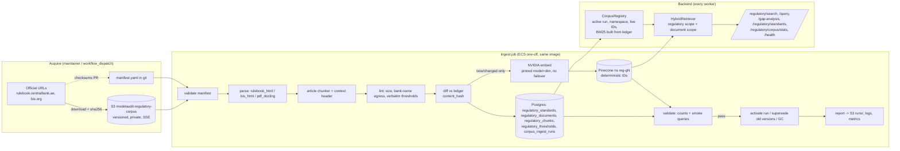

# Regulatory corpus ingestion plan (CBUAE-focused)

Date: 2026-09-30. Status: **plan approved. Owner decisions applied on 2026-09-30 (D1: Basel and IFRS 9 in scope, licence-gated; D2: AGENTS.md amendments applied; D3: no fake fallback, tenant-policy relabel). Nothing implemented yet.** Target: `main` @ `48816f7`, the version deployed on Vercel and ECS.
**Live status and the pickup protocol are in [README.md](README.md). Start there.**
Inputs: [QA audit](live-app-audit-2026-09-30.md) (QA-001, QA-002, QA-003, QA-008, QA-009, QA-016). The master plan that covers every finding is [remediation-plan-2026-09-30.md](remediation-plan-2026-09-30.md).
Method: the planning lead read the code (all `file:line` references below were checked against `48816f7`). The official sources, NVIDIA and Gemini model status, and Pinecone limits were checked on the web on 2026-09-30. Anything that could not be confirmed is marked **UNVERIFIED**.

---

## 0. Decisions in one page

1. **The corpus is data, not code.** Source documents live in a versioned, private **S3 bucket**. A reviewed **manifest in git** (`backend/regulatory_corpus/manifest.yaml`) lists every source with its checksum, version, effective date, jurisdiction and license note. `backend/base_documents/` stays gitignored and is used for local development only.
2. **Postgres is the source of truth. Pinecone and BM25 are derived indexes.** One ingest run writes the catalog (`regulatory_standards`), the document versions, a chunk ledger (`regulatory_chunks`) and structured thresholds (`regulatory_thresholds`). The same run then upserts the same chunk IDs to Pinecone. At query time, BM25 is built from the ledger, and dense hits that are not in the ledger's live set are dropped. Catalog, vectors and BM25 therefore cannot drift apart.
3. **Structure-aware chunking.** Each chunk is one article (e.g. MMG `3.9.5`), with its section path, heading and deep link kept for citation. We will not reuse the generic `MarkdownChunker` for regulatory text (§6.2).
4. **One pinned embedding space.** The model is `nvidia/nemotron-3-embed-1b`, with the output dimension pinned explicitly to the index dimension. Embeddings never fail over to another provider. The regulatory namespace is shared by all tenants and named per *generation* (embedding model + dimension + chunker version), e.g. `reg-g1`. A run is idempotent: IDs are deterministic and content-hashed, so an unchanged manifest means no work. Model or chunker changes use a blue/green rebuild. Superseded versions are deleted by ID.
5. **The hardcoded fallback is removed from production (approved, D3).** `CBUAE_REGULATORY_CORPUS` (`backend/app/services/retrieval/hybrid_retriever.py:38-139`) is **not** CBUAE text. It asserts thresholds that the real MMS and MMG do not contain (§1.2). It moves to a test fixture. With no active corpus, `/regulatory/search` returns **503** "regulatory corpus not loaded". Document chat still answers, and says plainly that regulatory context is unavailable.
6. **Gap analysis and policy checks use the catalog (QA-008; relabel approved, D3).** The numeric thresholds that CBUAE actually publishes (the appendix tables of MMS and MMG) are extracted into `regulatory_thresholds` and checked verbatim against the parsed text. The Gini, AUC, KS and PSI limits are relabelled as **tenant policy** (the MMS requires institutions to set their own limits) rather than "CBUAE MMG".
7. **Privacy (AGENTS.md amended, D2).** Regulatory text is public, not tenant data. It is embedded and sent to providers unmasked, after a bank-name egress lint at ingest. The masker learns a curated public vocabulary from the manifest (fixing QA-009). Before egress validation, each session's registry is substituted into the public context. Zero-trust for tenant data is unchanged.
8. **It runs loudly.** A new CLI, `python -m scripts.regulatory ...`, runs as an ECS one-off after `alembic upgrade head` in the deploy workflows and through a manual `regulatory-corpus.yml` workflow. It uses non-zero exit codes for every failure mode. Health checks, a startup warning, a stats endpoint and golden-set evaluation gates are included.
9. **Scope at go-live (D1): CBUAE Tier 1 + Basel + IFRS 9, licence-gated.** Every source carries a `license` block in the manifest, and the ingest job enforces what may be stored and shown (§2.1):
   - CBUAE: `full_text` (public regulation).
   - Basel CRE20-22 and CRE30-36: `brief_excerpt` (paragraph ID, heading, at most 400 verbatim characters with "© BIS" attribution, plus a short summary and a deep link) until BIS grants written permission (owner action O4), then `full_text`.
   - IFRS 9 impairment: `reference_only` (paragraph ID, official heading and a **human-reviewed**, team-written summary; no verbatim text) until the IFRS Foundation grants a licence (O3), then `full_text`.
   - Switching a source to `full_text` is a one-line manifest change plus licence evidence. The pipeline is otherwise identical.

---

## 1. Current state (verified)

### 1.1 Why the corpus is empty
| Layer | Finding | Evidence |
|---|---|---|
| Source files | None in the repo, the image or any pipeline. `backend/base_documents/` is gitignored. | `.gitignore:33`, `backend/Dockerfile:31` (`COPY . .` from the CI checkout) |
| Indexer | Prints "Directory not found" and returns with **exit 0** | `backend/scripts/index_regulatory_corpus.py:14-17` |
| Indexer quality | Random `uuid4` IDs make re-runs duplicate every vector. Sections are guessed from a `":"` heuristic. Page is always `None`. There is no version or effective-date metadata. | `index_regulatory_corpus.py:48-50,69` |
| Pipelines | Only `alembic upgrade head` runs as a one-off. No seed or index step exists. | `.github/workflows/deploy-production.yml:46-71` |
| Catalog seed | Never run. **Its content is not CBUAE text** (see 1.2). | `backend/scripts/seed_regulatory_standards.py:8-107` |
| Retrieval | Namespace `"cbuae-manuals"` is hardcoded. Dense exceptions are swallowed. BM25 over 10 hardcoded paragraphs is used only when there is no document. | `hybrid_retriever.py:286-288`, `:301-302`, `:208-248` |

### 1.2 The hardcoded corpus and seed catalog contradict the real CBUAE text (new, high impact)
The in-force **Model Management Standards** (MMS, rulebook node 4881) and **Model Management Guidance** (MMG, node 4961), both issued with Notice 5052/2022, were fetched from `rulebook.centralbank.ae` on 2026-09-30 and compared with the app:

- The MMG **does not set** Gini, AUC, KS, PSI or Brier limits. It says institutions "should establish a list of metrics … and compare these metrics against pre-defined limits" (MMG 2.11.1). It recommends considering "a maximum acceptable drop in accuracy ratio" (2.11.2) and says institutions "should implement acceptable limits" (3.9.5). MMS 9.4.1 says the same for monitoring.
- The numeric thresholds CBUAE does publish are in the appendix tables:
  - MMS Table 3: the 6-month self-assessment (2.2.2), a quarterly Model Oversight Committee (4.6.3), annual rating frequency (8.6.2/8.6.3) and **12-month maximum remediation for high-severity findings (10.7.7)**.
  - MMS Table 2: minimum monitoring and validation frequencies by model type and tier (10.5).
  - MMG Tables 13/14: **90 DPD default definition (2.5.2)**, re-rating 70% within 6 months and 95% within 9 months (2.9.1), **≥5 years for TTC PD (3.4.6)**, **LGD floor 5%, or 1% for cash and guarantees (4.1.5)**, ≥5 years of macro time series (5.2.2), 60 DPD for low-default portfolios (suggested), 4-year maximum recovery period (4.3.6), and others.
- The app's content does not match:
  - `CBUAE_REGULATORY_CORPUS` "Section 4" states "Gini ≥ 0.40, AUC-ROC ≥ 0.70, KS ≥ 30".
  - "Section 6" gives PSI bands of 0.10 and 0.25.
  - The seed has "CBUAE MMG §4.2.1 … Max 10% Gini Delta" and "§4.2.4 … IV > 0.02 and VIF < 2.5". The real MMS §4.2 is *Model Objectives and Strategy*.
  - `policy_checker.py` labels every Gini, AUC, KS, PSI, HL and Brier rule `rule_basis="CBUAE MMG"` (`:139,158,177,197,217,236`).

Consequences:
- Production citations "CBUAE-MMG-2022 / Section N" point to text that does not exist. For a compliance product, this is a correctness defect in its own right.
- The old seed script **must not be run**, even as a quick fix for QA-002.
- QA-003's "expected" answer (PSI bands from MMG) came from the fake corpus. With the real corpus, the correct answer is: *"MMG does not prescribe a PSI threshold. Institutions must set limits (MMS 9.4.1, MMG 2.11.1). Your tenant policy uses 0.10 and 0.25."* The acceptance criteria in §15 use this answer.

### 1.3 Other code facts that shape the design
- **The chunker never splits table blocks.** `backend/app/services/chunker.py:233-237` appends each markdown table as one chunk with no size cap. The CBUAE rulebook lays out every article as a table row (`| 3.7.1 | text |`), so an entire section would become one chunk. `:248` also drops any piece under 8 words, which loses short articles and list items.
- **Extractor scope.** `DocumentExtractor` accepts only PDF and DOCX (`backend/app/services/document_extractor.py:36-43`, `:60-63`).
- **Embedding dimension is not pinned.** The model card for `nvidia/nemotron-3-embed-1b` gives **2048** dimensions, with Matryoshka slicing to 1024 or 512. `NvidiaProvider.embed` does not pass `dimensions` (`nvidia_provider.py:225-230`). AGENTS.md says the index is 1024-dim. User-document upserts do work, so the live index dimension and the hosted default must be checked before the first ingest (§15.1, step 3). **UNVERIFIED**
- **Embeddings can fail over across providers.** `LLMRouter.embed` goes through `_execute_routed` (`router.py:355-361`), so a failed NVIDIA call would embed with Gemini, which is a different vector space. Gemini `text-embedding-004` was shut down on 2026-01-14 (Google deprecations page), so today this just fails. If someone "fixes" Gemini, index and query vectors would silently mix.
- **Masking will conflict with real text.** Tested against `NERMasker._is_protected` at `48816f7`: `"Basel III"`, `"Basel III IRB"`, `"SR 11-7"`, `"Model Management Standards"` and `"Central Bank of the UAE"` are **not** protected (`ner_masker.py:184-191`), so spaCy ORG spans get masked. Real regulatory context repeats these phrases verbatim, so the egress registry check (`egress_validator.py:78-87`) would block prompts with **422**. This will happen much more often with the real corpus than with the 10 paragraphs. QA-009 is therefore a **prerequisite** of go-live.
- **Pinecone Starter limits.** 100 namespaces per index, 2 GB, 1M read and 2M write units per month (pinecone.io/pricing, 2026-09-30). User documents use one namespace per document (`documents.py:315`), so the 100-namespace cap will be hit on Starter. The regulatory corpus therefore uses **one** namespace per generation.

---

## 2. Sources, scope and licensing

"Verified" means the page was fetched on 2026-09-30 and its status, URL and number were read there. Dates marked **TO CONFIRM** must be taken from the official notice.

| Tier | doc_key | Document | Authority / jurisdiction | Official source (parse source + record copy) | Version / dates | Binding | License note |
|---|---|---|---|---|---|---|---|
| 1 | `cbuae-mms` | Model Management Standards | CBUAE / AE | HTML: `https://rulebook.centralbank.ae/en/entiresection/4881`; PDF: `https://rulebook.centralbank.ae/sites/default/files/en_net_file_store/CBUAE_EN_4881_VER1.pdf` (also `centralbank.ae/media/0oaarr3a/model-management-standards-attach-to-notice-5052-2022.pdf`) | Notice 5052/2022, "VER1", status In-Force (verified). Published ~21-23 Dec 2022 (secondary sources); effective one day after publication (MMS 2.2.1). **Exact dates TO CONFIRM** | Mandatory | Public regulation: `license.status: public`. Reuse terms not located; this is treated as non-blocking (official regulator publication, cited with source). |
| 1 | `cbuae-mmg` | Model Management Guidance | CBUAE / AE | HTML: `.../entiresection/4961`; PDF: `.../CBUAE_EN_4961_VER1.pdf` | Same notice and dates as MMS (verified In-Force) | Guidance ("should"; appendix "strongly recommended") | as above |
| 1 | `cbuae-crm-reg` | Credit Risk Management Regulation | CBUAE / AE | `https://rulebook.centralbank.ae/en/rulebook/credit-risk-management-regulation`; PDF `CBUAE_EN_5974_VER1.pdf` | Circular C 3/2024, effective 30/11/2024, In-Force (verified) | Mandatory | as above |
| 1 | `cbuae-crm-std` | Credit Risk Management Standards (SICR Art. 7, classification and provisioning Art. 9, credit risk models Art. 13, which carry the UAE IFRS 9 staging rules) | CBUAE / AE | `https://rulebook.centralbank.ae/en/rulebook/credit-risk-management-standards`; PDF `CBUAE_EN_5996_VER1.pdf` | C 3/2024, effective 30/11/2024, In-Force (verified) | Mandatory | as above |
| 2 | `cbuae-rm-reg` | Risk Management Regulation (Circular 153/2018; MMS 1.1.1 cites it as the parent) | CBUAE / AE | rulebook `risk-management-regulation` | **TO CONFIRM** | Mandatory | as above |
| 2 | `cbuae-cap-std`, `cbuae-cap-guid` | Standards and Guidance for Capital Adequacy of Banks in the UAE (credit risk standardised approach) | CBUAE / AE | rulebook `standards-capital-adequacy-banks-uae`, `guidance-capital-adequacy-banks-uae` | **TO CONFIRM** | Mandatory / guidance | as above |
| **1b (go-live, D1)** | `bcbs-cre-sa` / `bcbs-cre-irb` | Basel Framework CRE20-22 (standardised approach) and **CRE30-36 (IRB; CRE36 minimum requirements carries the rating-system design, quantification and validation rules most relevant to model validation)** | BCBS / international | `https://www.bis.org/basel_framework/` (chapter pages carry the in-force date in the URL, e.g. `/standard/cre/20/inforce/...`); consolidated PDF `https://www.bis.org/baselframework/BaselFramework.pdf` as the record copy | Per chapter in-force date | International reference. CBUAE capital rules appear to use the standardised approach, so IRB content is labelled `jurisdiction=INT` and "international reference", **never** as a CBUAE requirement (applicability **UNVERIFIED**). | BIS notice: "Brief excerpts may be reproduced or translated provided the source is stated." Ingest mode **`brief_excerpt`** until written BIS permission for full text (O4). |
| **1b (go-live, D1)** | `ifrs-9` | IFRS 9 *Financial Instruments*, Section 5.5 Impairment, the related Appendix A definitions and the B5.5 application guidance | IASB / international | IFRS Foundation (`ifrs.org`, registered access); record copy **not** stored until licensed. Reference cards cite paragraph numbers and link to the official page. | Current issued version (record the edition year in the manifest) | International accounting standard. The UAE-specific staging and provisioning expectations are in `cbuae-crm-std` (full text) and MMG §5. | IFRS Foundation copyright: commercial reproduction needs a licence (`permissions@ifrs.org`, O3). Ingest mode **`reference_only`** (no verbatim text) until licensed. |
| 3 (later, optional) | `frb-sr-11-7` | SR 11-7 / OCC 2011-12 Model Risk Management guidance | FRB & OCC / US | federalreserve.gov (SR 11-7 letter + attachment PDF) | 2011-04-04 | Reference | US government work (public domain) **UNVERIFIED for the attachment** |

Scope (**decided, D1**): go live with **Tier 1** (MMS, MMG, CRM Regulation + Standards) in `full_text` mode, **plus Tier 1b** (Basel CRE20-22 and CRE30-36 in `brief_excerpt` mode; IFRS 9 impairment in `reference_only` mode). Tier 2 (CBUAE Risk Management Regulation, capital adequacy standards and guidance) follows in P1 as tracker item **C-T2**. Tier 3 is optional and not scheduled.

### 2.1 Licence-gated ingest modes (D1)

Each manifest document has a `license` block. The manifest loader and the ingest job enforce it (exit 2 on violation):

| `license.status` | Allowed `ingest_mode` | What is stored in S3 / Postgres / Pinecone and shown in the UI |
|---|---|---|
| `public` (e.g. CBUAE rulebook) | `full_text` | Full article text, as in the rest of this plan |
| `permission_granted` | `full_text` | Full text. `license.evidence` is **required**: a short reference to the licence or permission record (date, counterparty, scope). Never commit the licence document or any credentials. |
| `brief_excerpt_allowed` (BIS default) | `brief_excerpt` | Per paragraph: `para_id` (e.g. `CRE36.1`), heading path, a verbatim excerpt **≤ 400 characters** (lint-enforced), a team-written summary ≤ 600 characters, `attribution: "© Bank for International Settlements, Basel Framework CRE36"`, and the deep link. The UI shows the attribution on every citation. The full chapter HTML is kept only as a private S3 parse input and is never served. |
| `reference_only` (IFRS 9 default) | `reference_only` | Per paragraph or paragraph group: `para_ids`, the official heading, a **team-written summary** (≤ 600 characters, no verbatim sentences), keywords, `reviewed_by` and `reviewed_at`, and the link to the official page. No source file is stored. Cards live in git (`backend/regulatory_corpus/reference_cards/ifrs9.yaml`, §6.3). |

Enforcement rules:
- `ingest_mode` must be allowed by `license.status` (table above).
- In `ENVIRONMENT=production`, a `reference_only` card with `reviewed_by: null` fails the ingest (O7).
- The `brief_excerpt` lint fails any chunk whose verbatim part exceeds 400 characters.
- The prompt, the UI and the citations label excerpt and reference entries clearly ("summary; see the official text"), and the answer prompt tells the model not to quote beyond the provided text.
- Upgrading a source (e.g. after an IFRS licence): set `status: permission_granted`, add `evidence`, switch to `full_text`, add the record copy to S3 through `acquire`, and bump the document `version` so the ledger and Pinecone swap cleanly (§5 steps 9-15).

Versioning rules:
- Each (doc_key, version) is immutable.
- A new rulebook "VER2" PDF, or a changed HTML checksum, is a **new version**. The ingest job marks the previous version `superseded` when the new one is activated.
- `effective_date` is the date the text applies from. `published_date` is the notice date.
- A **freshness check** (a weekly workflow, P2) fetches HEAD/ETag for each `origin_url` and opens a GitHub issue if anything changed. It never ingests on its own.

---

## 3. Architecture



ASCII fallback:
```
official URLs --acquire--> S3 sources/ (+ sha256 into manifest.yaml via PR)
manifest.yaml + S3 --ingest--> parse -> chunk -> lint -> diff(ledger) -> embed(new) -> Pinecone reg-gN
                                                   \-> Postgres ledger/catalog/thresholds -> validate -> activate
backend: CorpusRegistry(Postgres) -> live IDs + BM25 ; HybridRetriever(Pinecone reg-gN + user-docs) -> APIs
```

---

## 4. Storage and manifest

### 4.1 S3
- Bucket `modelaudit-regulatory-corpus` in us-east-1. Versioning ON, Block Public Access ON, SSE-S3 (or KMS), lifecycle keeping noncurrent versions for 365 days. It is shared by staging and prod: sources are public and identical, and run artifacts are separated by an env prefix.
- Layout:
  ```
  sources/{doc_key}/{version}/{filename}           # immutable inputs (html snapshot, pdf record copy)
  runs/{env}/{run_id}/manifest.yaml                # exact manifest used
  runs/{env}/{run_id}/chunks.jsonl.gz              # exact chunk texts + ids embedded (audit/replay)
  runs/{env}/{run_id}/report.json                  # stats, lint findings, validation results
  ```
- IAM:
  - ECS task role: `s3:GetObject` on `sources/*`, `s3:PutObject` on `runs/*`, `s3:ListBucket`.
  - Acquire workflow role: `s3:PutObject` on `sources/*` with `s3:if-none-match` (no overwrite).
  - Prefer GitHub OIDC over the static keys currently used in `deploy-*.yml:26-31`.
- Why not git: redistributing BIS and IFRS material in a possibly public portfolio repo, binary size, and the need for immutable checksummed inputs. The manifest in git has **no licensed content**.

### 4.2 Manifest (example; the checksums are placeholders to be filled by `acquire`)
```yaml
# backend/regulatory_corpus/manifest.yaml
manifest_version: 1
corpus: regulatory
generation:                     # changing any field here => new Pinecone namespace (blue/green rebuild)
  id: g1
  embedding: {provider: nvidia, model: nvidia/nemotron-3-embed-1b, dimensions: 1024}   # dims = live index dim (verify)
  chunker: {name: regulatory-article, version: "1.0.0", target_chars: 1400, max_chars: 3500, min_chars: 250}
storage: {bucket: modelaudit-regulatory-corpus, prefix: sources/}
public_terms:                   # curated vocabulary never masked (QA-009); bank names are rejected by the loader
  - CBUAE
  - Central Bank of the UAE
  - Central Bank of the United Arab Emirates
  - Model Management Standards
  - Model Management Guidance
  - Model Oversight Committee
  - Basel Committee on Banking Supervision
  - Basel II
  - Basel III
  - Basel IV
  - SR 11-7
  - OCC 2011-12
  - IFRS 9
  - IFRS Foundation
  - IASB
  - Bank for International Settlements   # loader test: must not trip BankNameMatcher
  - Basel Framework
  - IRB
  - Expected Credit Loss
  - SICR
standards:
  - slug: cbuae-mmg
    code: "CBUAE MMG"
    title: "Model Management Guidance"
    authority: "Central Bank of the UAE"
    jurisdiction: AE
    category: "Model Risk Management"
    binding_strength: guidance
    aliases: ["MMG", "CBUAE MMG", "Model Management Guidance"]
    documents:
      - doc_key: cbuae-mmg
        version: "2022-VER1"
        notice: "Notice 5052/2022"
        published_date: null          # TO CONFIRM (Dec 2022)
        effective_date: null          # TO CONFIRM (publication + 1 day, MMS 2.2.1)
        status: in_force
        source_url: https://rulebook.centralbank.ae/en/rulebook/model-management-guidance
        parser: rulebook_html
        expected_articles_min: 350    # lint guard: fail if the parser finds fewer (set after first dry-run)
        files:
          - role: parse_source
            format: html
            origin_url: https://rulebook.centralbank.ae/en/entiresection/4961
            s3_key: sources/cbuae-mmg/2022-VER1/entiresection-4961.html
            sha256: "<filled by acquire>"
            fetched_at: "2026-10-01T00:00:00Z"
          - role: record_copy
            format: pdf
            origin_url: https://rulebook.centralbank.ae/sites/default/files/en_net_file_store/CBUAE_EN_4961_VER1.pdf
            s3_key: sources/cbuae-mmg/2022-VER1/CBUAE_EN_4961_VER1.pdf
            sha256: "<filled by acquire>"
        license: {status: public, note: "CBUAE public rulebook (official regulation)"}
        ingest_mode: full_text
    thresholds:                     # curated, machine-verified against parsed text (verbatim_contains)
      - {article: "2.5.2", metric_key: default_definition_dpd, operator: "<=", value: 90, unit: days,
         strength: strongly_recommended, applies_to: [rating, pd], verbatim_contains: "90 days"}
      - {article: "3.4.6", metric_key: ttc_pd_min_history_years, operator: ">=", value: 5, unit: years,
         strength: strongly_recommended, applies_to: [pd], verbatim_contains: "5 years"}
      - {article: "4.1.5", metric_key: lgd_floor_pct, operator: ">=", value: 5, unit: pct,
         strength: strongly_recommended, applies_to: [lgd], verbatim_contains: "5%"}
    gap_checklist:                  # articles used to build the LLM gap-analysis checklist (QA-008)
      pd: ["3.9.*", "2.11.3"]
      rating: ["2.11.*"]
      lgd: ["4.7.*"]
  - slug: cbuae-mms
    code: "CBUAE MMS"
    # ... same shape; thresholds from MMS Table 3 (e.g. 10.7.7 remediation <= 12 months, mandatory)
  - slug: bcbs-cre-irb                # Tier 1b (D1): brief excerpts until BIS permission (O4)
    code: "Basel CRE36"
    title: "Basel Framework CRE30-36: IRB approach"
    authority: "Basel Committee on Banking Supervision"
    jurisdiction: INT                 # never labelled as a CBUAE requirement
    category: "Credit Risk Capital (international reference)"
    binding_strength: international_reference
    aliases: ["CRE36", "IRB minimum requirements", "Basel IRB"]
    documents:
      - doc_key: bcbs-cre-irb
        version: "inforce-<yyyymmdd>"   # from the chapter URL's in-force date
        status: in_force
        source_url: https://www.bis.org/basel_framework/
        parser: bis_html
        license: {status: brief_excerpt_allowed, note: "BIS: brief excerpts may be reproduced provided the source is stated", evidence: null}
        ingest_mode: brief_excerpt
        attribution: "© Bank for International Settlements, Basel Framework"
        files:
          - {role: parse_source, format: html, origin_url: "https://www.bis.org/basel_framework/chapter/CRE/36.htm", s3_key: "sources/bcbs-cre-irb/<version>/CRE36.htm", sha256: "<filled by acquire>"}
          # CRE30-35 likewise; CRE20-22 go in slug bcbs-cre-sa
  - slug: ifrs-9                      # Tier 1b (D1): reference cards until an IFRS Foundation licence (O3)
    code: "IFRS 9"
    title: "IFRS 9 Financial Instruments: impairment"
    authority: "International Accounting Standards Board"
    jurisdiction: INT
    category: "Accounting: Expected Credit Loss"
    binding_strength: accounting_standard
    aliases: ["IFRS 9", "IFRS9", "ECL standard"]
    documents:
      - doc_key: ifrs-9
        version: "<edition-year>"
        status: in_force
        source_url: https://www.ifrs.org/issued-standards/list-of-standards/ifrs-9-financial-instruments/
        parser: reference_cards
        license: {status: reference_only, note: "IFRS Foundation copyright; commercial reproduction needs a licence (permissions@ifrs.org)", evidence: null}
        ingest_mode: reference_only
        cards_file: reference_cards/ifrs9.yaml   # in git; team-written summaries, human-reviewed (§6.3)
        files: []                                # nothing stored in S3 until licensed
smoke_queries:                      # post-ingest validation gate (§12 step 12)
  - {q: "minimum period for estimating TTC PD", expect: "cbuae-mmg:3.4.6", k: 5}
  - {q: "maximum remediation period for high severity validation findings", expect: "cbuae-mms:10.7.7", k: 5}
  - {q: "how often must the Model Oversight Committee meet", expect: "cbuae-mms:4.6.3", k: 5}
  - {q: "days past due rebuttable presumption for significant increase in credit risk", expect: "ifrs-9:5.5.11", k: 5}
  - {q: "IRB minimum requirements for validation of internal estimates", expect: "bcbs-cre-irb:CRE36", k: 5}   # expect matches the chapter prefix
```
The manifest is loaded into Pydantic models in `app/services/regulatory/manifest.py`. `extra="forbid"` is set, and slugs, doc_keys and article references are validated. **The licence rules of §2.1 are validated here** (`ingest_mode` allowed by `license.status`, `evidence` required for `permission_granted`, `cards_file` required for `reference_only`). A manifest error means exit code 2.

---

## 5. Pipeline steps (ingest command)

| # | Step | Idempotency / failure behaviour |
|---|---|---|
| 1 | Load and validate the manifest, including the §2.1 licence rules; compute `manifest_sha256`. Take a Postgres advisory lock `pg_try_advisory_lock(hashtext('regulatory_ingest'))`. | Lock held => exit 5. Invalid manifest => exit 2. |
| 2 | Create a `corpus_ingest_runs` row (`status=running`, git SHA, image tag, generation, namespace). | Always recorded, including on failure. |
| 3 | `--if-changed`: if an **active** run has the same manifest SHA and generation, and the ledger/namespace consistency check passes, exit 0 "no-op". | Fast path on every deploy. |
| 4 | For each file: `GetObject` then compare sha256 with the manifest. | Missing object or mismatch => exit 2. **Never "succeed" with 0 inputs.** |
| 5 | Parse into an article tree (§6.1). | Fewer articles than `expected_articles_min`, or zero => exit 2. |
| 6 | Normalise (NFKC, collapse whitespace, repair split bold artefacts such as `Ar **ticle**`). Keep numbering and commas in numbers (AGENTS.md rule 10). | Deterministic. |
| 7 | Chunk (§6.2). `content_hash = sha256(doc_key|version|article_ids|normalised_text)`. `vector_id = f"reg:{doc_key}:{version}:{ordinal:05d}:{content_hash[:12]}"`. | Deterministic IDs => upserts are idempotent. |
| 8 | Lint: size bounds; duplicate hashes; **bank-name egress lint** (`BankNameMatcher` over every chunk; any hit fails unless the manifest lists that chunk in `bank_name_exceptions`); threshold `verbatim_contains` present in the cited article; `public_terms` contain no bank names; **licence lint**: `brief_excerpt` chunks carry at most 400 verbatim characters and an attribution; `reference_only` cards carry no source file, a summary of at most 600 characters and, in production, `reviewed_by`. | Failure => exit 2, and the report lists every finding. |
| 9 | Diff against the ledger for this doc version: new, unchanged and removed hashes. | Only *new* chunks are embedded. |
| 10 | Embed with the pinned provider, model and dimension (`input_type=passage`), in batches of 64. Retry and back off on 429 and 5xx (existing `_execute_with_retry`). Assert `len(vec) == generation.dimensions`. | Provider failure => exit 3, run `failed`, nothing activated. |
| 11 | Upsert to namespace `reg-{generation.id}` with metadata (§7.1). Then `fetch` a 1% sample (at least 5 IDs) to confirm the round trip. | Upserts are idempotent. |
| 12 | Write the ledger (`regulatory_documents`, `regulatory_chunks`, `regulatory_thresholds`) and upsert the catalog, all in one transaction, with rows tagged `run_id`. | Rolled back on error. |
| 13 | Validate: ledger live count vs `describe_index_stats().namespaces[ns].vector_count` (±0 once GC is complete, else ≤ live + stale). For each `smoke_query`, the expected article must appear in the top-k for **both** BM25 and dense. | Failure => exit 4, run `failed`, previous run stays active. |
| 14 | Activate: in one transaction, `is_active=true` on this run and false on the previous one. Mark superseded doc versions. Deactivate catalog rows not in the manifest (`status=withdrawn`). | Retrieval switches on the next registry refresh (≤ 60 s). |
| 15 | GC: delete the vector IDs of superseded versions and of stale hashes, **after** activation (the live-ID post-filter makes this safe). `--gc-namespaces` deletes previous-generation namespaces older than 14 days. | Re-runnable. |
| 16 | Report: `report.json` to S3, `stats_json` on the run row, and one structured log line `corpus_ingest_summary {...}`. Exit 0. | — |

Other subcommands:
- `acquire` downloads origin URLs, computes sha256, uploads to S3 without overwriting, and prints the manifest diff.
- `verify` runs steps 1-9 without provider calls. It is safe in CI with read-only S3.
- `activate --run-id` and `rollback` flip the active pointer back.
- `gc`.
- `stats` prints the same JSON as the endpoint.

Exit codes: 0 ok or no-op; 2 input, manifest or lint; 3 provider or network; 4 post-ingest validation; 5 lock held; 1 unexpected.

---

## 6. Parsing and chunking

### 6.1 Parsers (`app/services/regulatory/parsers/`)
- **`rulebook_html`** (MMS, MMG, CRM, capital adequacy):
  - The rulebook "entire section" page renders every article as a table row whose first cell is the article number (`3.7.1`) or a sub-item marker (`(i)`, `a.`). Headings are `## 3.7 Independent Validation`.
  - Parse with BeautifulSoup and lxml. Assign each article to its section **by its number prefix** (`3.9.5` → `3.9` → `3`), **not** by heading nesting depth. The live page nests `## 6.3` under `## 6.4` (MMS markup quirk observed on 2026-09-30).
  - Capture definitions tables (`**Term**: text`) as one chunk per definition.
  - Capture appendix and threshold tables as structured rows (§10).
  - Capture section node links (`/en/node/NNNN`) where present, for `source_url` deep links.
- **`bis_html`** (Tier 1b, go-live, D1): Basel chapter pages carry paragraph ids such as `CRE36.1` and footnotes.
  - Parse paragraph by paragraph, with the heading path (chapter › section › paragraph). Take the version from the in-force date in the URL. Drop footnote markers but keep footnote text as a separate child of its paragraph.
  - In `brief_excerpt` mode, the chunk text is `summary` plus `excerpt`: the first sentence(s) of the paragraph, truncated at a sentence boundary to at most 400 characters. The summary is team-written and stored in `backend/regulatory_corpus/reference_cards/basel_summaries.yaml`, keyed by `para_id`. Paragraphs without a summary use the excerpt alone. Summaries are optional for Basel, because excerpts are allowed.
  - Chunking: one chunk per paragraph; consecutive short paragraphs of the same section are merged into groups of up to 3 paragraphs while the excerpt limit still holds per paragraph.
  - In `full_text` mode (after O4), the same parser emits full paragraphs and the §6.2 rules apply.
- **`pdf_docling`** (fallback for PDF-only sources): reuse `DocumentExtractor` with an HTML-capable variant (add `InputFormat.HTML` in a separate converter, not in the tenant upload path). Split the markdown on article-number patterns (`^\d+(\.\d+)+\s`). Keep `page_start` and `page_end` from Docling provenance.
- Parser output (`parsers/base.py`):
  ```python
  @dataclass(frozen=True)
  class Article:
      doc_key: str; article_id: str; section_number: str; section_title: str
      part: str | None; heading_path: tuple[str, ...]; text: str
      sub_items: tuple[str, ...]; page_start: int | None; page_end: int | None; source_url: str | None
  ```
- **`reference_cards`** (IFRS 9, D1): loads `reference_cards/*.yaml` from git (§6.3). No S3 input and no parsing. Each card becomes one chunk.
- Test fixtures: short excerpts (a few articles plus one appendix table; two or three Basel paragraphs trimmed to the excerpt limit; two IFRS 9 cards) saved under `backend/tests/fixtures/regulatory/`. Full documents never go in git.

### 6.2 Chunker (`app/services/regulatory/chunking.py`, `RegulatoryChunker`) — why not `MarkdownChunker`
`MarkdownChunker(2400, 400)` (`chunker.py:10`) is a generic sliding window. It has four problems for this corpus:
- It never splits tables (`:233-237`). Rulebook pages are tables.
- It drops pieces under 8 words (`:248`).
- The 400-character overlap duplicates legal text across citations.
- Section detection downstream relies on a `":"` string heuristic (`index_regulatory_corpus.py:48-50`, `documents.py:319-324`).

Keep `MarkdownChunker` for tenant uploads. Its table-size bug is tracked separately in the master plan, under QA-008 notes.

Rules:
1. **One chunk per article**, including its sub-items (i)…(x) and the article's own table rows.
2. **Merge** consecutive short articles (< `min_chars`=250) of the **same section** until `target_chars`≈1400. `article_ids` lists all of them, e.g. `["4.6.3","4.6.4"]`.
3. **Split** articles above `max_chars`=3500 at sub-item boundaries, repeating the article lead-in sentence in each part (`article_ids` stays the same, `part` becomes 1..n).
4. **Definitions**: one chunk per term. **Tables**: one chunk per table if under `max_chars`, otherwise row groups with the header row repeated.
5. **Context header**, used for embedding and BM25 but not in the display text: `"{authority} — {title} ({version}) › {part} › {section_number} {section_title} › Art. {article_ids}"`.
6. Sizes: about 250-900 tokens per chunk, well under the embedder's 4096-token limit (build.nvidia.com model card) and the reranker's 8192-token pair limit. Article granularity gives exact citations. No overlap: context comes from the header and article boundaries.
7. `chunker.version` is written to every chunk. Changing the rules means a new generation.

### 6.3 Reference cards (IFRS 9 in `reference_only` mode; optional Basel summaries)

File `backend/regulatory_corpus/reference_cards/ifrs9.yaml`:
```yaml
standard: ifrs-9
edition: "<edition-year>"
source_url: https://www.ifrs.org/issued-standards/list-of-standards/ifrs-9-financial-instruments/
cards:
  - para_ids: ["5.5.3"]
    heading: "Impairment: recognition of expected credit losses; general approach"   # official heading wording
    summary: >-                    # team-written, <= 600 chars, no copied sentences
      If credit risk on a financial instrument has increased significantly since initial recognition,
      the loss allowance is measured at lifetime expected credit losses rather than 12-month ECL.
    keywords: [SICR, lifetime ECL, stage 2]
    reviewed_by: null              # set by the human reviewer (O7); production refuses null
    reviewed_at: null
```
- **Initial card list** (paragraph numbers to be confirmed against the official text by the reviewer):
  - 5.5.1-5.5.2: scope of the loss allowance.
  - 5.5.3-5.5.5: lifetime versus 12-month ECL.
  - 5.5.9-5.5.11: SICR assessment; low credit risk; the **30 days past due** rebuttable presumption.
  - 5.5.12: modified assets.
  - 5.5.15-5.5.16: the simplified approach.
  - 5.5.17-5.5.20: ECL measurement (unbiased, probability-weighted, time value of money, reasonable and supportable information, maximum period).
  - Appendix A definitions: credit-impaired, lifetime ECL, 12-month ECL, credit loss.
  - B5.5.15-B5.5.24: SICR indicators and collective assessment.
  - **B5.5.37**: default definition; the **90 days past due** rebuttable presumption.
  - B5.5.42-B5.5.55: measurement and forward-looking information.
  - About 25-35 cards in total.
- **Authoring**: an agent may draft summaries from general knowledge of IFRS 9. The drafts must not paste text from the standard. A human with IFRS 9 expertise reviews every card for accuracy and "own words", then sets `reviewed_by` and `reviewed_at` (O7). The PR that adds cards needs that human's review in GitHub.
- **Retrieval and prompts**: cards are indexed like any chunk (dense and BM25 over `heading + summary + keywords`). They are cited as `[Source: IFRS 9, para 5.5.11 (summary)]`. The system prompt says: "IFRS 9 entries are summaries, not the standard's text; do not present them as quotations; refer the user to the official text for exact wording."
- **Upgrade to full text** after O3: switch the manifest per §2.1. The cards file stays as curated metadata (headings and keywords boost BM25).

---

## 7. Metadata schema

### 7.1 Pinecone vector metadata (flat, filterable; about 1-6 KB per vector)
| Field | Type | Example | Notes |
|---|---|---|---|
| `corpus` | str | `regulatory` | Always set. Lets a filter guard against namespace mix-ups. |
| `standard_slug` / `standard_code` | str | `cbuae-mmg` / `CBUAE MMG` | `standard_code` is shown as the citation source |
| `standard_id` | str (uuid) | … | FK to `regulatory_standards.id` |
| `doc_key`, `doc_version` | str | `cbuae-mmg`, `2022-VER1` | |
| `status` | str | `in_force` | Also filterable. The retriever still post-filters by live IDs. |
| `effective_date` / `effective_ts` | str / int | `2022-12-24` / epoch | `$lte` filters for "as of" queries |
| `jurisdiction`, `authority`, `binding_strength` | str | `AE`, `CBUAE`, `guidance` | |
| `section_number`, `section_title`, `section_path` | str | `3.9`, `Validation of PD Models`, `3 PD Models › 3.9 Validation of PD Models` | |
| `article_ids` | list[str] | `["3.9.5"]` | Used by citation and eval matching |
| `page_start`, `page_end` | int | 41, 42 | PDF sources only |
| `source_url` | str | rulebook node or page URL | Deep link in the UI |
| `chunk_ordinal`, `content_hash` | int, str | 812, `9f…` | |
| `embedding_model`, `embedding_dim`, `chunker_version`, `generation`, `run_id` | str/int | | Traceability |
| `text` | str | article text (display) | Public text, at most about 8 KB. In `brief_excerpt` mode: summary + excerpt ≤ 400 verbatim characters. In `reference_only` mode: summary only. |
| `ingest_mode`, `license_status`, `attribution` | str | `brief_excerpt`, `brief_excerpt_allowed`, `© Bank for International Settlements, Basel Framework` | Drives the UI label ("excerpt", "summary") and the attribution line |

### 7.2 Postgres (new migration; §17)
- `regulatory_standards` (existing, extended): `slug` (unique), `short_name`, `status`, `binding_strength`, `source_url`, `aliases_json`, `updated_at`. Keep `code` unique and `clauses_json`, which is now **derived** from thresholds and key articles for the existing UI.
- `regulatory_documents`: one row per (doc_key, version) with `sha256`, `s3_key`, `origin_url`, `published_date`, `effective_date`, `status`, `superseded_by_id`, `parser`, `parser_version`, `run_id`, and (D1) `ingest_mode`, `license_status`, `license_evidence` (short text, nullable), `attribution` (nullable).
- `regulatory_chunks`: the chunk ledger. `vector_id` (unique), `document_id`, `standard_id`, `ordinal`, `article_ids` (JSON), `section_number`, `section_title`, `section_path`, `text`, `header`, `content_hash`, `char_count`, `page_start`, `page_end`, `source_url`, `chunker_version`, `run_id`, `ingest_mode` (denormalised for fast citation labelling), `verbatim_chars` (for the licence lint audit).
- `regulatory_thresholds`: `standard_id`, `document_id`, `article_ref`, `metric_key`, `topic`, `operator`, `value_numeric`, `value_text`, `unit`, `strength` (mandatory|strongly_recommended|recommended|suggested), `applies_to` (JSON model types), `verbatim`, `chunk_id`. Unique on (standard_id, article_ref, metric_key).
- `corpus_ingest_runs`: `id`, `mode`, `status`, `started_at`, `finished_at`, `manifest_sha256`, `git_sha`, `image_tag`, `generation`, `namespace`, `embedding_provider`, `embedding_model`, `embedding_dim`, `chunker_version`, `is_active` (partial unique index where true), `stats_json`, `error_text`, `triggered_by`.

These tables hold **global public reference data with no `tenant_id`**, which is an intentional exception to AGENTS.md "Multi-Tenancy Rules". They are writable only by the ingest job; the API exposes only reads. **AGENTS.md was amended on 2026-09-30 (D2) to allow this.**

---

## 8. Embeddings and index

- **Model**: `nvidia/nemotron-3-embed-1b` (already used for tenant documents). The regulatory namespace and `user-docs:*` must be in the same space, because one query embedding searches both. Pass `input_type=passage` at ingest and `query` at query time (already mapped at `nvidia_provider.py:224`). Pass `truncate="END"` explicitly.
- **Dimension**: pin `dimensions` in the embeddings request, via `extra_body={"dimensions": N}` if the hosted NIM supports it. Otherwise slice to N and L2-renormalise on the client. Assert `len == N`. N is the **live index dimension**, checked by `describe_index`. The value is recorded in `generation.embedding.dimensions` and on every run.
- **No cross-provider failover for embeddings**: `LLMRouter.embed(..., allow_failover=False)` becomes the default (`router.py:355-361`). If NVIDIA embedding is down, dense retrieval is marked `dense_error=true` and BM25 still serves. Traces and the UI show the degradation (§14).
- **Namespace**: `reg-{generation.id}` (e.g. `reg-g1`), shared by all tenants because it holds no tenant data. It replaces the hardcoded `"cbuae-manuals"` (`hybrid_retriever.py:286`). The active namespace is read from `CorpusRegistry`, not from code.
- **IDs and upserts**: deterministic IDs (§5 step 7), batch 100, `upsert` is idempotent. The run records `upserted`, `skipped_unchanged` and `deleted`.
- **Superseded versions**: after activation, delete by ID list from the ledger. This does not rely on delete-by-metadata, which serverless support varies on. It is safe because retrieval drops non-live IDs.
- **Re-index** (new embedding model, dimension or chunker): bump `generation.id`, ingest into the new namespace, validate, flip the active run, keep the old namespace 14 days for rollback, then `gc --namespaces`. If the dimension changes, tenant documents must also be re-embedded, possibly in a **new index**, because Pinecone dimension is per index. That is a separate migration, flagged in §21.
- **Budget**: 4 Tier-1 documents at about 150-400 KB of text each is roughly 1.5-3k chunks. Tier 1b adds about 1-1.5k Basel paragraph chunks (CRE20-22 and CRE30-36, excerpt-sized) and about 30 IFRS 9 cards. The total is about 3-4.5k chunks, or about 15-30 MB in Pinecone. Initial writes are about 4.5k WU and each re-ingest writes only deltas. That is within Starter limits apart from the namespace cap noted in §1.3. Embedding about 4.5k chunks at batch 64 is about 70 calls. Allow for NVIDIA free-tier rate limits (§21).

---

## 9. BM25

- **Persisted source**: `regulatory_chunks` (same chunks, same IDs as Pinecone). **Index**: `RegulatoryBM25`, built in each process from the live ledger rows with the existing `BM25Okapi` (`bm25.py`, same tokenizer that keeps comma numbers). It indexes `header + text`, so "MMG 3.9" queries hit. The build is lazy on first use and cached by `active_run_id`. `CorpusRegistry` checks the active run every 60 s with one cheap query and rebuilds on change. Cost for about 3k chunks is well under 1 s.
- Why not serialize the fitted index to S3: rebuilding from the ledger is fast and deterministic, it cannot diverge from Postgres, and it works on SQLite in CI. Postgres FTS (tsvector + GIN) is a P2 option if the corpus grows by 10x.
- **Fix**: filter `score > 0` (HANDOFF backlog 5; `bm25.py:87-129` returns zero-score docs). Otherwise `bm25_count` is always the corpus size and the reranker scores irrelevant passages.
- **Fallback**: `CBUAE_REGULATORY_CORPUS` moves to `backend/tests/fixtures/regulatory_sample.py`, labelled "illustrative, not CBUAE text", for offline tests and the dev UI. A new setting, `REGULATORY_FALLBACK=off|sample` (default `off`), is **refused at startup when `ENVIRONMENT=production`**. In production with no active run:
  - `/regulatory/search` returns 503 `{"detail":"Regulatory corpus is not loaded. Contact your administrator."}`.
  - `/query` answers from the document only and emits `regulatory_context: "unavailable"` in the SSE `trace`/`citations` events.
  - `/gap-analysis` returns 503. It cannot claim a CBUAE assessment without the corpus.

---

## 10. Catalog, thresholds and wiring (QA-002, QA-008)

1. **Catalog seeding from the same manifest.**
   - The `standards[]` entries are upserted by `slug` in step 12, in the same transaction as the chunks.
   - `clauses_json` is regenerated as `[{"clause": "MMG 3.4.6", "topic": ..., "requirement": <verbatim>, "threshold": "≥ 5 years", "strength": "strongly recommended", "source_url": ...}]` so the existing Library UI works unchanged.
   - `scripts/seed_regulatory_standards.py` becomes a shim that prints a pointer to `python -m scripts.regulatory ingest` and **exits 1**. Its fabricated clauses are deleted.
2. **Thresholds.**
   - Two sources feed `regulatory_thresholds`: the parser's appendix-table extraction (MMS Tables 2 and 3, MMG Tables 13 and 14) and the curated `thresholds:` entries in the manifest.
   - Every threshold must pass `verbatim_contains` inside the cited article's parsed text, or the ingest fails (exit 2). This keeps a human in the loop and machine-checks the result.
3. **Policy checker** (`backend/app/services/analytics/policy_checker.py`):
   - Gini, AUC, KS, PSI, HL and Brier keep their numeric defaults and tenant settings, but `rule_basis` becomes `"Tenant policy (MMS 9.4.1 requires institution-defined limits)"` instead of `"CBUAE MMG"` (`:139,158,177,197,217,236`).
   - Add `regulatory_refs: list[str]` to `PolicyResult` (`schemas/metrics.py:53` area), filled from the catalog (e.g. `["CBUAE MMS 9.4.1", "CBUAE MMG 2.11.2"]`).
   - CAR, Tier 1 and NPA (`:299-337`) are not MMS or MMG content. Relabel them `"CBUAE capital adequacy (verify)"` until Tier 2 is ingested, then link them to thresholds.
4. **LLM gap analysis** (`backend/app/api/gap_analysis.py:80-85`):
   - Replace the 4 hardcoded strings with a checklist built from `gap_checklist` articles for the model type (PD by default; the type is detected from extracted metrics) plus the relevant `regulatory_thresholds`.
   - Retrieve the top 8 regulatory chunks for the masked document summary, include them as "Regulatory requirements", and require `article_ref` in each gap (schema change in `schemas/gap_analysis.py`).
   - Uses the structured-output path from master plan PR-02.
5. **One source of numbers.** The frontend shows thresholds only from `PolicyResult` and the catalog. The contradiction between "AUC ≥ 0.70" in Q&A and "≥ 0.75" in the workspace disappears, because the regulatory Q&A can no longer cite fake numbers.

---

## 11. Retrieval changes (QA-001, QA-003)

- **Scopes.** `HybridRetriever.retrieve(query, tenant_id, db, scopes=[RegulatoryScope(), DocumentScope(document_id)], top_k, mode)`:
  - **Regulatory scope**: dense on `CorpusRegistry.namespace`, post-filtered to live IDs; BM25 on `RegulatoryBM25`; RRF within the scope.
  - **Document scope**: dense on `user-docs:{tenant}:{doc}`; BM25 on that document's chunks (existing `_fetch_chunks_for_document`, tenant-filtered, `hybrid_retriever.py:157-185`).
  - **Merge by quota, not a single RRF.** BM25 scores from different corpora are not comparable, and document chunks would crowd out regulation. Take `k_reg = 3`, `k_doc = top_k - 3` (a regulatory-only call uses `k_reg = top_k`). Then rerank the union with the cross-encoder so the order is meaningful. If the reranker is down, interleave regulatory and document chunks.
  - Diagnostics per scope: `regulatory_dense_count`, `regulatory_bm25_count`, `document_*`, `dense_error` vs `dense_empty`, `corpus_run_id`.
- **Callers**:
  - `/regulatory/search`: regulatory scope only; 503 if the corpus is empty.
  - `/query` without a document: regulatory scope.
  - `/query` with a document: both scopes. This fixes QA-003, where the regulatory branch was reached only when `document_id is None` (`hybrid_retriever.py:208-248`).
  - `/gap-analysis`: regulatory scope (§10).
  - The eval runner records `corpus_run_id` on each run.
- **Prompt layout** (`app/services/evaluation/prompts.py` and `app/api/query.py:349-363`):
  ```
  Regulatory context (public):
  [R1] CBUAE MMG Art. 3.9.5 — Validation of PD Models (in force since …): …
  Model document context (masked):
  [D1] Uploaded document, section "Calibration": …
  ```
  System prompt additions:
  - Cite regulation as `[Source: CBUAE MMG, Art. 3.9.5]` and the document as `[Source: DOC-1, Section: …]`.
  - When the regulation sets no numeric limit, say so, and use the tenant policy threshold if one is provided in the context.
  - Never invent article numbers.
  Raw filenames are never placed in prompts (master plan QA-004).
- **Citation schema** (`app/schemas/retrieval.py:54-63`): add optional `scope` (`regulatory|document`), `standard_code`, `standard_id`, `article_ids`, `source_url`, `effective_date`, `document_id`, `chunk_id`. The change is additive, so SSE and JSON clients keep working. The frontend `ChatSource` maps `document_id` directly instead of guessing from `doc-{id}` or the filename (`WorkspaceView.tsx:391-395`).
- **UI copy**: "Grounded in <file> and the regulatory corpus" (`WorkspaceView.tsx:1024`, `:1063`, `HelpModal.tsx:23`) becomes true. When the trace says `regulatory_context: unavailable`, show a banner instead.

---

## 12. Privacy and egress

1. **Classification.** Manifest-listed sources are public reference text, not tenant data. They are embedded, reranked and sent to the LLM **unmasked**. AGENTS.md "egress validator before every provider call" is still honoured: at ingest, the bank-name check (step 2 of `EgressValidator`) runs on every chunk before embedding (§5 step 8). At query time, the full prompt is validated as today. AGENTS.md was clarified accordingly on 2026-09-30 (D2). Basel excerpts and IFRS 9 reference cards are public reference material under the same rule.
2. **Why "Basel III IRB" was masked (QA-009, verified).**
   - spaCy tags the span as ORG.
   - `_is_protected` (`ner_masker.py:184-191`) protects a composite span only if **every** word is in `PROTECTED_DOMAIN_TERMS ∪ PROTECTED_METRIC_NAMES`. `iii` and `cre36` are not, so the span is masked. `"Model Management Standards"` and `"Central Bank of the UAE"` fail the same way (reproduced by calling `_is_protected`).
   - Fix (master plan PR-05):
     - (a) Load `public_terms`, standard codes, titles, aliases and authorities from the manifest or catalog into the protected vocabulary at startup. Skip any term that `BankNameMatcher` matches, because bank names always win.
     - (b) Composite rule: a span is protected if every word is vocabulary **or** a citation token (roman numerals I–X, `\d+(\.\d+)*`, codes like `CRE\d+(\.\d+)?`, `SR`, `11-7`, `2011-12`), **and** at least one word is vocabulary.
     - (c) Unit tests for 40 regulator phrases.
3. **Registry substitution on public context (defence in depth).**
   - Before `egress_validator.validate(prompt, registry)`, apply the session registry's forward mapping to the **regulatory context block only**. This is the same regex pass as `masking_pipeline.py:89-96`: any string the user's question caused to be masked (e.g. an unlisted regulator name) is replaced by its token in the public text too.
   - Result: no 422, a consistent token for the LLM, and nothing unmasked leaks. It is safe because substitution can only remove raw entity strings.
4. **Tenant data is unchanged.**
   - Questions, history and document chunks are masked exactly as before.
   - The bank matcher still hard-blocks.
   - The regulatory namespace contains no tenant data, and tenant namespaces still include `tenant_id` (AGENTS.md).
   - Pinecone metadata for tenant documents stops carrying the raw filename (master plan QA-004 / NEW-03).
5. **Egress test gate.** The golden set plus 10 vocabulary questions ("Basel III IRB", "Central Bank of the UAE", "Model Management Standards", "SR 11-7", "Basel CRE36") must produce **zero** 422s in the post-deploy smoke test (§15).

---

## 13. Execution in their infrastructure

- **Image**: same backend image. The manifest ships in `backend/regulatory_corpus/`. Add `boto3`, `beautifulsoup4`, `lxml` and `pyyaml` to `backend/requirements.txt` (pin them).
- **Config** (`app/config.py`): `ENVIRONMENT` (`development|staging|production`), `CORPUS_S3_BUCKET`, `CORPUS_LOCAL_DIR` (dev), `REGULATORY_FALLBACK` (`off|sample`, refused in production), `REGULATORY_CORPUS_ENABLED` (kill switch, default `true`), `EMBEDDING_DIMENSIONS`, `NVIDIA_EMBEDDING_MODEL`. Secrets are already present (`NVIDIA_API_KEY`, `PINECONE_*`, `DATABASE_URL`).
- **ECS one-off** (same pattern as the migration step, `deploy-production.yml:46-71`):
  ```bash
  TASK_ARN=$(aws ecs run-task --cluster modelaudit-cluster --task-definition modelaudit-backend-task \
    --launch-type FARGATE \
    --network-configuration "awsvpcConfiguration={subnets=[$ECS_SUBNET],securityGroups=[$ECS_SG],assignPublicIp=DISABLED}" \
    --overrides '{"containerOverrides":[{"name":"backend","command":["python","-m","scripts.regulatory","ingest","--manifest","regulatory_corpus/manifest.yaml","--if-changed","--activate"],"environment":[{"name":"CORPUS_S3_BUCKET","value":"modelaudit-regulatory-corpus"}]}]}' \
    --query 'tasks[0].taskArn' --output text)
  aws ecs wait tasks-stopped --cluster modelaudit-cluster --tasks "$TASK_ARN"
  EXIT_CODE=$(aws ecs describe-tasks --cluster modelaudit-cluster --tasks "$TASK_ARN" \
    --query 'tasks[0].containers[?name==`backend`].exitCode | [0]' --output text)
  [ "$EXIT_CODE" = "0" ] || { echo "::error::Regulatory corpus sync failed ($EXIT_CODE)"; exit 1; }
  ```
  Note: `aws ecs wait tasks-stopped` gives up after 10 minutes. A first full ingest of about 3k chunks takes roughly 2-6 minutes; if it takes longer, loop the wait.
- **Deploy integration**: in `deploy-production.yml` and `deploy-staging.yml`, add a step "Sync regulatory corpus" **after** "Run Alembic migrations" and **before** "Update ECS service". It fails the deploy on a non-zero exit. Because ingest is blue/green, a failure never degrades the live corpus. A `workflow_dispatch` input `skip_corpus_sync` covers emergencies.
- **Manual workflow** `.github/workflows/regulatory-corpus.yml`: `workflow_dispatch` with inputs `environment` (staging|production), `command` (verify|ingest|rollback|gc|acquire) and `run_id`. It runs the same one-off, then `aws logs tail <log-group> --since 30m --filter-pattern corpus_ingest` into the job log.
- **PR CI** (`ci.yml`): parser, chunker and ingest unit tests on fixtures (fake S3 directory, fake embedder, fake Pinecone), plus `python -m scripts.regulatory verify --local-fixtures` (no network).
- **Environment check (verify first, master plan NEW-06)**: staging and prod both use task definition family `modelaudit-backend-task` (`deploy-staging.yml:21`, `deploy-production.yml:22`). Before the first ingest, confirm which `DATABASE_URL` and `PINECONE_INDEX_NAME` the family uses. Otherwise a staging run may write the prod catalog.

---

## 14. Observability and health

- **Logs**: one JSON line per stage (`corpus_ingest_stage`) and a final `corpus_ingest_summary` (docs, articles, chunks new/unchanged/deleted, embed calls, tokens estimate, upserts, duration, warnings). On failure, `corpus_ingest_failed` with exit code and reason. Add a CloudWatch metric filter on `corpus_ingest_failed` with an SNS alarm.
- **`GET /regulatory/corpus/stats`** (auth required, read-only, public metadata):
  ```json
  {"state":"ready","active_run":{"id":"...","activated_at":"...","manifest_sha256":"...","generation":"g1",
   "namespace":"reg-g1","embedding_model":"nvidia/nemotron-3-embed-1b","embedding_dim":1024},
   "standards":[{"code":"CBUAE MMG","version":"2022-VER1","effective_date":"...","status":"in_force","chunks":612,"thresholds":11}],
   "totals":{"documents":4,"chunks":1840,"thresholds":24},
   "pinecone":{"namespace_vector_count":1840,"checked_at":"...","consistent":true},
   "bm25":{"docs":1840,"built_at":"...","run_id":"..."}}
  ```
  The Pinecone count is cached for 5 minutes.
- **`GET /health`** (`app/api/health.py`): add `"regulatory_corpus": "ready|empty|inconsistent"` from the cached registry. Always return **200** so the ALB target health is unaffected. Add a `status: "degraded"` field when the corpus is not ready.
- **Startup**: in `lifespan` (`app/main.py:16-25`), load the registry and log `WARNING REGULATORY_CORPUS_EMPTY` or `INFO regulatory corpus ready run=… chunks=…`.
- **RAG dashboard**:
  - The trace adds `corpus_run_id` and `regulatory_context`.
  - The TelemetryPanel banner distinguishes "corpus not loaded" from "embedding or Pinecone unreachable" (`dense_error`).
  - `EvalRunComparison.tsx:212-219` stops blaming "Pinecone or embedding provider unreachable" when the namespace is simply empty (QA-016).

---

## 15. Verification and acceptance

### 15.1 Pre-flight (before the first ingest; read-only)
1. `describe_index(PINECONE_INDEX_NAME)` gives dimension, metric and plan limits. `describe_index_stats()` lists namespaces and counts (expect `cbuae-manuals` absent or 0).
2. List the ECS task definition env and secret **names** only, for staging and prod (NEW-06).
3. Embed "test" with `nvidia/nemotron-3-embed-1b` (synthetic text) and check the returned length. Also check whether `dimensions` is accepted.
4. Dry run: `python -m scripts.regulatory verify` against S3. Record the article and chunk counts, then set `expected_articles_min` in the manifest.

### 15.2 Golden set v2 (replaces the 22 cases tied to the fake corpus)
- File `backend/regulatory_corpus/golden/v2.yaml`, at least 30 cases:
  - About 15 from the MMS and MMG appendix threshold tables (exact article, unambiguous answer).
  - About 10 conceptual (governance 3.1.x and 4.6.x, validation scope 10.3 and 10.4, validation frequency Table 2 in 10.5, SICR in CRM Standards Art. 7, default definition in CRM Standards Art. 6).
  - About 5 negative or "no numeric limit" cases (e.g. the PSI threshold, whose correct answer says none is prescribed).
  - **About 8 Basel and IFRS 9 cases (D1)**:
    - IFRS 9: 30 DPD SICR presumption → `ifrs-9` 5.5.11; 90 DPD default presumption → B5.5.37; lifetime vs 12-month ECL → 5.5.3 and 5.5.5; ECL measurement inputs → 5.5.17.
    - Basel: IRB PD estimation data history, IRB validation requirements, definition of default and SA risk-weight basics → CRE36 or CRE20 paragraphs, fixed at authoring time from the parsed IDs.
    - A "UAE vs international" case: the answer must say IRB content is an international reference, not a CBUAE requirement.
- Targets use `{source: "CBUAE MMG", section: "3.4.6", keywords: [...]}`, or `{source: "IFRS 9", section: "5.5.11"}` or `{source: "Basel CRE36", section: "CRE36.xx"}`. Extend `metrics.target_matches` (`metrics.py:160-185`) to match against `article_ids` (`para_ids` for cards).
- `default_dataset.py` loads v2 instead of importing `CBUAE_REGULATORY_CORPUS` (`:20`, `:206-213`). `restore-defaults` deactivates v1 keys (`cbuae-s*`) and inserts v2 keys (`cbuae-v2-*`) for existing tenants.

### 15.3 Acceptance criteria (staging first, then production)
| # | Criterion |
|---|---|
| AC1 | `/regulatory/corpus/stats` shows state `ready`, at least 4 Tier-1 CBUAE documents in force **plus** the Basel (CRE20-22, CRE30-36) and IFRS 9 documents, `consistent=true`, chunk count equal to the dry-run count, and each document's `ingest_mode` as the manifest states. |
| AC2 | `GET /regulatory/standards` returns every manifest standard, each with at least 1 threshold where the source has one. Global search for "CBUAE" and "Model Management" returns standards (QA-002). |
| AC3 | Regulatory Q&A "What is the minimum period for TTC PD estimation under the CBUAE MMG?" gives `regulatory_dense_count > 0` and an MMG 3.4.6 citation in the top 3; the answer contains "5 years" (QA-001). |
| AC4 | Workspace AI Analyst on a synthetic PD document, asked "What does the CBUAE MMG require for PSI thresholds and does this model comply?": citations include at least 1 regulatory article **and** at least 1 document chunk. The answer states that no numeric PSI limit is set by the MMG and compares against tenant policy. No fabricated article numbers (QA-003). |
| AC5 | RAG Performance eval on golden v2, all 4 modes, k=5, generation on. Record the baseline. Initial gates: `hybrid_rerank` Hit@5 ≥ 0.85 and MRR ≥ 0.65; `dense` Hit@5 ≥ 0.70; `bm25` Hit@5 ≥ 0.60; faithfulness ≥ 0.8. Below a gate, tune the chunker or header before go-live. |
| AC6 | A second ingest with an unchanged manifest exits 0 with "no-op", 0 embed calls and 0 upserts. |
| AC7 | A deleted S3 source or a changed sha256 gives exit 2, a red workflow, and the active run unchanged. |
| AC8 | Zero 422 responses across golden v2 plus 10 regulator-vocabulary questions (QA-009). |
| AC9 | `CBUAE_REGULATORY_CORPUS` is not importable from `app/` (a test enforces it). With `ENVIRONMENT=production`, `REGULATORY_FALLBACK=sample` refuses to start. |
| AC10 | Rerank applied in ≥ 95% of regulatory traces over 24 h (needs master plan PR-01). |
| AC11 | `/health` shows `regulatory_corpus: ready`, and the startup log has the corpus summary line. |
| AC12 | **Licence gates (D1)**: the ledger has no Basel chunk with `verbatim_chars > 400` and no IFRS 9 chunk with verbatim source text. Every Basel citation in the UI shows the BIS attribution; every IFRS 9 citation is labelled "summary". A manifest that sets `ifrs-9` to `full_text` without `permission_granted` + `evidence` fails `verify` with exit 2. In production, an unreviewed IFRS 9 card fails the ingest. |

---

## 16. Code changes by file

| File | Change |
|---|---|
| `backend/regulatory_corpus/manifest.yaml` (new) | Manifest (§4.2) |
| `backend/regulatory_corpus/golden/v2.yaml` (new) | Golden set v2 (incl. Basel and IFRS 9 cases) |
| `backend/regulatory_corpus/reference_cards/ifrs9.yaml`, `basel_summaries.yaml` (new) | IFRS 9 reference cards (reviewed, §6.3); optional Basel summaries |
| `backend/app/services/regulatory/__init__.py`, `manifest.py`, `storage.py` (S3 or local reader with sha256 check), `parsers/{base,rulebook_html,bis_html,pdf_docling,reference_cards}.py`, `licensing.py` (§2.1 rules), `chunking.py`, `lint.py`, `ingest.py` (async orchestrator), `registry.py` (`CorpusRegistry`: active run, namespace, live-ID set, `RegulatoryBM25` cache), `bm25_index.py`, `thresholds.py` (new) | Core pipeline |
| `backend/scripts/regulatory/__main__.py` (new) | CLI: `acquire`, `verify`, `ingest`, `activate`, `rollback`, `gc`, `stats`; exit codes §5 |
| `backend/scripts/index_regulatory_corpus.py`, `seed_regulatory_standards.py` | Replace with shims that print the new command and `sys.exit(1)` (never exit 0 again) |
| `backend/app/models/regulatory.py` (new); `app/models/system.py` | New ORM models. Move `RegulatoryStandard` here and re-export from `system.py`; add columns |
| `backend/alembic/versions/e1f2a3b4c5d6_regulatory_corpus.py` (new) | §17 |
| `backend/app/services/retrieval/hybrid_retriever.py` | Remove `CBUAE_REGULATORY_CORPUS` (→ `tests/fixtures/regulatory_sample.py`); scope-aware `retrieve`; namespace from registry; live-ID post-filter; per-scope diagnostics; quota merge |
| `backend/app/services/retrieval/dense_retriever.py` | Map new metadata into candidates; report `dense_error` vs empty per namespace |
| `backend/app/services/retrieval/bm25.py` | `min_score` filter (> 0) |
| `backend/app/schemas/retrieval.py` | `Citation` optional fields; `RetrievalDiagnostics` per-scope counts, `dense_error`, `corpus_run_id` |
| `backend/app/api/regulatory.py` | 503 when the corpus is empty; `GET /regulatory/standards?authority=&jurisdiction=&category=&q=`; `GET /regulatory/standards/{id}` (articles index + thresholds); `GET /regulatory/corpus/stats` |
| `backend/app/schemas/regulatory.py` | Detail and stats schemas; `question` min and max length (QA-018) |
| `backend/app/api/query.py` | Both scopes when a document is present; new prompt layout; registry substitution on the public block (with master plan PR-04) |
| `backend/app/api/gap_analysis.py`, `schemas/gap_analysis.py` | Catalog checklist + retrieved articles + `article_ref` (QA-008) |
| `backend/app/services/analytics/policy_checker.py`, `schemas/metrics.py` | `rule_basis` relabel; `regulatory_refs` |
| `backend/app/services/evaluation/{prompts,default_dataset,metrics,runner,telemetry}.py` | New prompts and context format; golden v2 loader and upgrade; `article_ids` matching; record `corpus_run_id` |
| `backend/app/services/llm/router.py`, `nvidia_provider.py` | `embed(allow_failover=False)`; pinned `dimensions` and `truncate`; model IDs from config (master plan PR-01) |
| `backend/app/services/privacy/ner_masker.py` | Public vocabulary loader + composite rule (master plan PR-05) |
| `backend/app/main.py`, `app/api/health.py`, `app/config.py` | Registry warm-up and startup log; health component; new settings; production guard for the fallback |
| `backend/requirements.txt` | `boto3`, `beautifulsoup4`, `lxml`, `pyyaml` (pinned) |
| `.github/workflows/regulatory-corpus.yml` (new); `deploy-production.yml`, `deploy-staging.yml`; `ci.yml` | Manual workflow; corpus sync step; fixture tests |
| `frontend/src/types.ts`, `lib/adapters.ts`, `components/RegulatoryLibraryView.tsx`, `components/WorkspaceView.tsx`, `components/rag/TelemetryPanel.tsx`, `components/rag/EvalRunComparison.tsx` | New citation fields (article, link, snippet); corpus-unavailable banner; correct degradation banners; standard detail view |
| `backend/tests/` | `test_regulatory_manifest.py` (incl. licence rules), `test_regulatory_parser_rulebook.py`, `test_regulatory_parser_bis.py` (excerpt limit, attribution), `test_regulatory_reference_cards.py` (reviewed gate, summary length), `test_regulatory_chunker.py`, `test_regulatory_ingest.py` (idempotency, exit codes, bank-name lint, verbatim thresholds), `test_corpus_registry.py`, `test_hybrid_retriever_scopes.py`, `test_regulatory_api_corpus_state.py` (503 and stats), `test_privacy_regulatory_vocab.py`, `test_default_dataset_v2.py`, `test_no_hardcoded_corpus_in_app.py` |
| `HANDOFF.md`, `deployment_steps.md` | Runbook replaces the `index_regulatory_corpus` instructions (`deployment_steps.md:546-576,1066`). (`.agents/AGENTS.md` was already amended on 2026-09-30, D2.) |

---

## 17. Alembic migration

Revision `e1f2a3b4c5d6_regulatory_corpus` (down_revision `d4e5f6a7b8c9`). Use generic types (`sa.Uuid`, `sa.JSON`) as the existing migrations do, so the SQLite CI keeps working.

```python
def upgrade() -> None:
    with op.batch_alter_table("regulatory_standards") as b:           # batch mode for SQLite
        b.add_column(sa.Column("slug", sa.String(), nullable=True))
        b.add_column(sa.Column("short_name", sa.String(), nullable=True))
        b.add_column(sa.Column("status", sa.String(), nullable=False, server_default="in_force"))
        b.add_column(sa.Column("binding_strength", sa.String(), nullable=True))
        b.add_column(sa.Column("source_url", sa.String(), nullable=True))
        b.add_column(sa.Column("aliases_json", sa.JSON(), nullable=True))
        b.add_column(sa.Column("updated_at", sa.DateTime(), nullable=True))
    op.execute("UPDATE regulatory_standards SET slug = lower(replace(replace(code,' ','-'),'/','-')) WHERE slug IS NULL")
    op.create_index("ix_regulatory_standards_slug", "regulatory_standards", ["slug"], unique=True)

    op.create_table("corpus_ingest_runs",  # id, mode, status, started_at, finished_at, manifest_sha256, git_sha, image_tag,
        ...)                               # generation, namespace, embedding_provider/model/dim, chunker_version,
                                           # is_active (bool, default false), stats_json, error_text, triggered_by
    op.create_index("uq_corpus_ingest_runs_active", "corpus_ingest_runs", ["is_active"], unique=True,
                    postgresql_where=sa.text("is_active"), sqlite_where=sa.text("is_active = 1"))
    op.create_table("regulatory_documents", ...)   # FK standard_id; unique(doc_key, version); ingest_mode, license_status, license_evidence, attribution
    op.create_table("regulatory_chunks", ...)      # FK document_id (CASCADE), standard_id; unique(vector_id); index(content_hash); unique(document_id, ordinal)
    op.create_table("regulatory_thresholds", ...)  # FK standard_id, document_id, chunk_id (SET NULL); unique(standard_id, article_ref, metric_key)

def downgrade() -> None:
    # drop the 4 tables and the added columns (batch mode); data is re-creatable from S3 + manifest
```
- Production `regulatory_standards` is empty (QA-002), so the backfill is trivial there. Dev databases seeded with the old fabricated rows are deactivated by the first ingest (`status=withdrawn`).
- `alembic check` must show no drift. Test upgrade and downgrade on SQLite **and** on a Postgres container in CI. HANDOFF §8 notes Postgres was never verified; add a `postgres:16` service job.

---

## 18. Runbook

```bash
# 0. One-time infra (owner)
aws s3api create-bucket --bucket modelaudit-regulatory-corpus --region us-east-1
aws s3api put-bucket-versioning --bucket modelaudit-regulatory-corpus --versioning-configuration Status=Enabled
aws s3api put-public-access-block --bucket modelaudit-regulatory-corpus \
  --public-access-block-configuration BlockPublicAcls=true,IgnorePublicAcls=true,BlockPublicPolicy=true,RestrictPublicBuckets=true
# attach the task-role policy from §4.1 to modelaudit-ecs-task-role

# 1. Acquire sources (maintainer laptop or workflow_dispatch command=acquire)
cd backend && python -m scripts.regulatory acquire --manifest regulatory_corpus/manifest.yaml --upload
#    -> commit the printed sha256/fetched_at diff to manifest.yaml via PR

# 2. Dry run (no provider calls)
python -m scripts.regulatory verify --manifest regulatory_corpus/manifest.yaml      # local, reads S3
gh workflow run regulatory-corpus.yml -f environment=staging -f command=verify

# 3. Staging ingest + eval
gh workflow run regulatory-corpus.yml -f environment=staging -f command=ingest
curl -s -H "Authorization: Bearer $TOKEN" "$STAGING/regulatory/corpus/stats" | jq
#    RAG Performance -> Evaluation -> golden v2, 4 modes, k=5, generation on -> record baseline (AC5)

# 4. Production: merge to main => deploy-production runs migrations -> corpus sync -> rollout
gh run watch   # "Sync regulatory corpus" step must be green
curl -s -H "Authorization: Bearer $TOKEN" "https://<app>/api/regulatory/corpus/stats" | jq '.state,.totals'

# 5. Updating a regulation later: acquire new version -> PR manifest (new version entry) -> merge -> deploy syncs
```

## 19. Rollback

| Situation | Action |
|---|---|
| Bad content or quality after activation | `gh workflow run regulatory-corpus.yml -f environment=production -f command=rollback -f run_id=<previous>`. This flips `is_active` in one transaction; every worker picks it up within 60 s. GC has not deleted the previous vectors, because superseded-version deletes run only after the **next** successful activation. |
| Ingest failed | Nothing to do: the previous run stays active. Fix and re-run. |
| Migration problem | `alembic downgrade d4e5f6a7b8c9` (tables are re-creatable from S3 + manifest), then deploy the previous image. |
| Emergency: disable the regulatory path | Set `REGULATORY_CORPUS_ENABLED=false` (new kill switch). `/regulatory/search` returns 503 and chat runs document-only with a banner. This is not the fake fallback. |
| Generation change regret | Re-activate the old generation's run. Its namespace is kept for 14 days. |

## 20. PR breakdown (corpus workstream; C-numbers are referenced by the master plan)

| PR | Scope | Depends on | Effort |
|---|---|---|---|
| C1 | Migration (§17), ORM models, manifest schema and loader **with the §2.1 licence rules**, catalog upsert from manifest, seed/index scripts turned into failing shims (AGENTS.md is already amended, D2) | — | M |
| C2 | Parsers (`rulebook_html`, `pdf_docling` fallback), `RegulatoryChunker`, lint (bank names, verbatim thresholds), fixtures and tests (CBUAE sources) | C1 | L |
| **C2b** | **(D1)** `bis_html` parser in `brief_excerpt` mode (CRE20-22, CRE30-36), `reference_cards` loader, IFRS 9 card drafts (`ifrs9.yaml`, `reviewed_by: null` until O7), licence lint, fixtures and tests. Runs in parallel with C2. | C1 | M/L |
| C3 | Ingest orchestrator + CLI + S3 storage + ledger + Pinecone upsert/GC + `CorpusRegistry` + `RegulatoryBM25` + `/regulatory/corpus/stats` + health + startup log | C2, C2b, master PR-01 (pinned embeddings) | L |
| C4 | Retrieval integration: registry namespace, live-ID filter, dual scope, quota merge, prompts (incl. the excerpt and summary rules of §6.3), `Citation` fields (incl. `ingest_mode` and `attribution`), remove the hardcoded corpus from `app/`, 503 semantics, frontend citation, attribution and banner updates | C3, master PR-04 | M |
| C5 | `regulatory-corpus.yml`, deploy-step integration, IAM and S3 setup (O5), `acquire` for CBUAE and Basel sources, first staging ingest, then production. IFRS 9 goes to production only once its cards are reviewed (O7); until then it is staging only. | C4, master PR-05 (vocabulary), master PR-18 (staging split, D9) | S/M |
| C6 | Golden set v2 + `article_ids` matching + v1→v2 upgrade + eval baseline (AC5) | C5, master PR-01 (reranker) | M |
| C7 | Thresholds wiring: policy relabel (D3) + `regulatory_refs`, catalog-driven gap analysis (QA-008). IFRS 9 staging questions in gap analysis cite `cbuae-crm-std` first and IFRS 9 cards second. | C6, master PR-02 | M |
| C-T2 | CBUAE Tier 2 (Risk Management Regulation, capital adequacy standards and guidance): manifest entries, parser checks, and links from the CAR, Tier 1 and NPA policy rules to real thresholds | C5 | M |

## 21. Risks

| Risk | Mitigation |
|---|---|
| Rulebook HTML markup changes and breaks the parser | Sources are snapshotted in S3 (the parser runs on a fixed snapshot). `expected_articles_min` lint. PDF fallback parser. |
| Licensing (BIS, IFRS) | Enforced in code (§2.1): Basel in `brief_excerpt` mode and IFRS 9 in `reference_only` mode until owner actions O4 and O3 produce written permission. AC12 is a release gate. Reference-card summaries are human-reviewed (O7). |
| IFRS 9 summaries are inaccurate | Human review gate (O7). Answers label them "summary" and point to the official text. The golden set checks the key paragraphs. |
| Users read Basel IRB content as UAE requirements | `jurisdiction=INT`, the "international reference" label on citations, a system-prompt rule, and a golden-set case. |
| Embedding dimension mismatch with the live index | Pre-flight check (§15.1). The assert in the ingest fails with exit 3 before any upsert. |
| Real text triggers more 422s | PR-05 vocabulary + registry substitution + AC8 gate. |
| NVIDIA free-tier rate limits during ingest | Batch 64, backoff, resumable: re-runs skip hashes already in the ledger. |
| Pinecone Starter namespace cap (user documents) | Out of scope here; flagged as NEW-07 in the master plan. The regulatory corpus uses 1-2 namespaces. |
| Answers now correctly say "no MMG threshold", which looks like a regression to users used to fake numbers | Release note and UI copy: show tenant policy thresholds as policy and cite the MMS requirement to set limits. |

## 22. Owner questions: resolved on 2026-09-30

| # | Question | Resolution |
|---|---|---|
| 1 | Scope | **D1**: Tier 1 CBUAE (full text) **plus** Basel CRE20-22 and CRE30-36 and IFRS 9 impairment at go-live. Tier 2 CBUAE follows in P1 (C-T2). |
| 2 | Basel and IRB | **D1**: included as an "international reference" (`jurisdiction=INT`), in `brief_excerpt` mode per BIS's standard notice until written permission (O4). |
| 3 | IFRS 9 licence | **D1**: included in `reference_only` mode (human-reviewed summaries, no verbatim text) until an IFRS Foundation licence (O3). The UAE staging rules also come from `cbuae-crm-std` (full text). |
| 4 | Other licensed or internal copies | Out of scope. Bank-internal policies are tenant data and would need a separate design. |
| 5 | Notice 5052/2022 dates | Taken from the notice during `acquire` (C5); no owner input needed. |
| 6 | AGENTS.md amendments (a)-(d) | **D2**: approved and applied to `.agents/AGENTS.md` on 2026-09-30. |
| 7 | Hardcoded fallback | **D3**: removed from production; 503 when the corpus is empty. |
| 8 | Environment isolation | **D9**: settled in master PR-00 and PR-18 before C5 (hard gate). |
| 9 | Policy relabel | **D3**: approved, with a release note (master plan QA-008). |

Owner **actions** (not decisions) are tracked in [README §7](README.md#7-owner-action-items): O3 (IFRS licence request), O4 (BIS permission, optional), O5 (S3 bucket and IAM), O7 (IFRS 9 card review).
