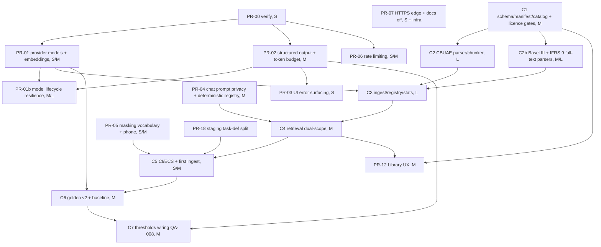

# Remediation plan for the 2026-09-30 live QA audit

Date: 2026-09-30. Status: **plan approved. Owner decisions D1-D6 were applied on 2026-09-30 (§0). No application code has been changed yet.**
**Live status, the work queue and the pickup protocol are in [README.md](README.md). Start there.** This file is the design; the README tracks progress.

> **Re-scoped 2026-10-02 (D12).** AWS is retired and the backend runs locally, only for demos. Read [aws-exit-and-rescope-plan.md](aws-exit-and-rescope-plan.md) §4 first: where this document mentions ECS, ALB, CloudFront, S3, SSM, CloudWatch, IAM, OIDC or a staging environment, that plan overrides it. PR-07 and PR-18 are superseded; PR-00, PR-01b, PR-06, C3 and C5 are rescoped. The re-scope is proposed until the owner answers its §9.
Target: `main` @ `48816f7`, the version deployed on Vercel and, inferred, ECS.
Inputs: [live-app-audit-2026-09-30.md](live-app-audit-2026-09-30.md) (QA-001..QA-026), `HANDOFF.md` (§5 config, §6 hosting, §7 deploy, §9 backlog) and `.agents/AGENTS.md` rules:
- async-first;
- `tenant_id` on every query;
- no raw entity names to any LLM, embedding or rerank provider;
- egress validator before every provider call.

The regulatory corpus design is in a separate document: **[regulatory-corpus-ingestion-plan.md](regulatory-corpus-ingestion-plan.md)** (referred to below as *CorpusPlan*). This plan links to it and does not repeat it.

How this was produced: the Agent tool was not available in this session, so the planning lead ran the four workstreams (corpus, LLM/provider reliability, privacy/security, frontend) directly. Every root cause below was re-checked against the code at `48816f7`. Where the QA agent could only form a hypothesis, the external facts were checked on the web on 2026-09-30 (NVIDIA and Google model pages, NIM docs, Pinecone pricing, CBUAE rulebook). AWS and CloudWatch were **not** accessible (the AWS MCP needs re-authentication), so those checks are written as the first step of each fix.

Legend:
- Effort: **S** ≤ 0.5 day, **M** 1-3 days, **L** 3-6 days.
- Root cause: **Verified** means confirmed from code, evidence or an external source. **Hypothesis** means it must be confirmed with the "Verify first" step before the fix merges.

---

## 0. Owner decisions applied (2026-09-30)

The full decision table is in [README §2](README.md#2-owner-decisions-2026-09-30-binding). This is how each decision changed this plan:

| Decision | Changed sections |
|---|---|
| **D1** (revised the same day) Basel III and IFRS 9 at go-live in **full text**, as a personal, non-commercial project | QA-001 risk; §3 (new PR **C2b**: full-text Basel and IFRS 9 parsers); CorpusPlan §0, §2, §2.1 (licence profile), §6.1, §15.2, §20; PR-05 vocabulary gains Basel and IFRS terms |
| **D2** AGENTS.md amendments approved | Applied in `.agents/AGENTS.md`. The "owner approval" notes in QA-006 and CorpusPlan §7.2, §12 and §22 are resolved. |
| **D3** Remove the fake fallback in production; tenant-policy relabel | QA-008 risk (decided; ship a release note), NEW-02, §5 |
| **D4** Gemini upgraded as the backup | QA-006 fix item 5 (rewritten), PR-01 and PR-02 scope, §5 |
| **D5** Keep open self-registration | QA-007 fix items 6-8 (abuse and cost controls), QA-019 (rewritten), PR-06, PR-14 |
| **D6** HTTPS by the most optimal route: CloudFront + VPC origin + internal ALB, no custom domain | NEW-01 (rewritten), PR-07, QA-007 item 6 (client-IP handling), QA-020 |
| **D10** Make the LLM layer robust to frequent model updates (owner request) | New findings NEW-09 and NEW-10, new **PR-01b** (§4 NEW-09), QA-006 item 5 (model chain), AGENTS.md rule 9 (re-amended) |
| D7-D9 (planner defaults) | QA-024 (no demo account), QA-007 item 5 (tiers), NEW-06 (gate on C5) |

External facts re-checked on 2026-09-30 while applying the decisions (web search; primary pages were blocked by the sandbox proxy, so treat these as **to re-verify at implementation**):
- **Gemini**: `gemini-3.6-flash` is GA (July 2026) with no retirement date announced. `gemini-2.5-flash` has an announced shutdown of **2026-10-16**, so it is **not** an acceptable default.
  - *PR-00 re-check (2026-09-30, Google's deprecations page, fetched live):* the page lists `gemini-2.5-flash` with "No shutdown date announced". It also lists `gemini-3.5-flash` (2026-05-19), `gemini-3.6-flash` (2026-07-21) and `gemini-3.8-flash` (2026-09-02), all with no shutdown date. The 2026-10-16 date is not on that page. D4 still excludes 2.5-flash; whether to keep that exclusion is the owner's call (README §8).
- **CloudFront VPC origins** support internal ALBs in private subnets through a CloudFront-managed ENI. They need at least 2 private subnets in different AZs for the ALB, a free IPv4 address in the subnet and IPv4 only. The ALB security group must allow the CloudFront managed prefix list.
- **BIS**: its standard notice says "Brief excerpts may be reproduced or translated provided the source is stated."
- **IFRS Foundation**: reproduction for commercial use needs a licence (`permissions@ifrs.org`). A free "Basic" ifrs.org account gives the issued standards as PDF; the illustrative examples, implementation guidance and basis for conclusions need a paid subscription.
- **Model churn (D10)**: Google already lists a newer Flash (3.8) alongside the 3.5 and 3.6 GA models. The family alias `gemini-flash-latest` is hot-swapped at each release, with an email notice only for breaking changes. NVIDIA retires NIM functions while leaving the IDs listed in `GET /v1/models` (code comment at `nvidia_provider.py:18-21`), so a catalogue listing does not prove a model works.

---

## 1. What changed versus the QA report (planning-lead verification)

| Topic | QA report said | Verified finding |
|---|---|---|
| QA-006 Gemini fallback | Hypothesis: invalid key or retired model | **Verified externally.** `gemini-2.0-flash` was shut down on **2026-06-01** (recommended replacement `gemini-3.6-flash`). `models/text-embedding-004` was shut down on **2026-01-14** (replacement `gemini-embedding-2`, or `gemini-embedding-001` until 2028-05-14). Source: ai.google.dev/gemini-api/docs/deprecations. The whole Gemini provider (`gemini_provider.py:16-17`) is dead, so no real failover exists. |
| QA-006 NVIDIA rerank | Hypothesis: endpoint deprecated | **Verified externally.** build.nvidia.com marks `llama-3.2-nv-rerankqa-1b-v2` "This NIM Endpoint has been deprecated". The successor is `nvidia/llama-nemotron-rerank-1b-v2` at `POST https://ai.api.nvidia.com/v1/retrieval/nvidia/llama-nemotron-rerank-1b-v2/reranking` (docs.api.nvidia.com). |
| QA-005 structured output | Hypothesis: model ignores `guided_json` | **Very likely, from code and docs.** The code sends `extra_body={"guided_json": schema}` at the top level (`nvidia_provider.py:140-142,152`). NIM documents `extra_body={"nvext": {"guided_json": schema}}` (docs.nvidia.com/nim/large-language-models/.../structured-generation). The observed output `"{\n\n{\n  \"differences\"…` with a stray comma is impossible under guided decoding. Also, `nvidia/nemotron-3-super-120b-a12b` reasons by default (`enable_thinking` defaults to true), which consumes the 1024-token budget. |
| QA-010 phone not masked | Hypothesis: Presidio regions | **Verified root cause is different.** `NERMasker._is_protected` treats any span with fewer than 2 letters as protected (`ner_masker.py:165-166`), and the digit/punctuation regex (`:169-170`) also matches phone numbers. **Every** phone number Presidio finds is therefore discarded, whatever the region. Reproduced by calling `_is_protected`: `+971 50 123 4567`, `(212) 555-1234` and `050-1234567` all return protected. Region support is a secondary issue. |
| QA-009 masking | "Basel III IRB" and "Basel CRE36" masked | Confirmed. `"Basel III"`, `"SR 11-7"`, `"Model Management Standards"` and `"Central Bank of the UAE"` are also unprotected. With a real corpus this becomes a source of **422s** (the retrieved text repeats these phrases), so the fix is a **prerequisite for the corpus go-live**. |
| QA-002 / QA-008 content | Catalog empty; thresholds inconsistent | The seed catalog and the hardcoded BM25 corpus contain requirements that **are not in the real CBUAE MMS or MMG**: "Gini ≥ 40%", "AUC ≥ 0.70", PSI bands, and "§4.2.1 Max 10% Gini Delta", while the real MMS §4.2 is *Model Objectives and Strategy*. The real numeric thresholds are the appendix tables (CorpusPlan §1.2). **Do not run the old seed script.** |
| QA-003 expected behaviour | Answer should cite the MMG PSI bands | The real MMG sets no PSI limit (MMG 2.11.1, 3.9.5; MMS 9.4.1 say institutions define limits). The acceptance criterion is corrected in CorpusPlan AC4. |
| QA-017 Escape | "no `keydown` handler anywhere" | Partly inaccurate. `useEscape` exists (`frontend/src/components/rag/ui.tsx:269-279`) and `TraceDetailDrawer.tsx:76`, `EvalRunResultsDrawer.tsx:69` and `EvalCaseEditorModal.tsx:139` use it. Re-test the trace drawer; the other overlays do lack it. |
| Embedding dimension | "1024-dim compatibility is fine" (inferred) | The model card for `nvidia/nemotron-3-embed-1b` gives **2048** dimensions (Matryoshka). The code does not pin `dimensions` (`nvidia_provider.py:225-230`). **Verify** the live index dimension before any corpus ingest. |

### New findings (not in the QA report)
| ID | Severity | Finding | Evidence |
|---|---|---|---|
| NEW-01 | High | The Vercel → AWS rewrite uses **plain HTTP**, so passwords, JWTs and uploaded (unmasked) documents cross the internet unencrypted between Vercel and the ALB | `frontend/vercel.json` rewrite `"destination": "http://modelaudit-alb-1304868163.us-east-1.elb.amazonaws.com/:path*"` |
| NEW-02 | High (compliance) | Fabricated regulatory requirements are served as CBUAE citations and used as `rule_basis="CBUAE MMG"` | `hybrid_retriever.py:38-139`, `seed_regulatory_standards.py:8-107`, `policy_checker.py:139…337`; CorpusPlan §1.2 |
| NEW-03 | Medium (privacy) | Raw upload filenames reach the LLM in every document-scoped prompt (`Source: {c.source}`) and are stored in Pinecone metadata. Filenames often contain client or bank names. | `api/query.py:349-352`, `api/documents.py:318-325` |
| NEW-04 | Medium | Gemini provider fully retired, so `LLM failover` is not real. AGENTS.md rule 9 pins a retired model. | see QA-006 row above |
| NEW-05 | Medium | Embeddings go through cross-provider failover, which would silently mix vector spaces if Gemini were revived | `router.py:355-361` |
| NEW-06 | Medium (verify) | Staging and prod deploys use the **same task-definition family** `modelaudit-backend-task`. Staging migrations and one-offs may run with prod env (DB, Pinecone). | `deploy-staging.yml:21`, `deploy-production.yml:22` |
| NEW-07 | Low (verify) | Pinecone Starter allows 100 namespaces per index. One namespace per uploaded document (`user-docs:{tenant}:{doc}`) will exhaust it. | pinecone.io/pricing; `documents.py:315` |
| NEW-08 | Medium | `/auth/*` has **no** rate limiting at all (the limiter needs a JWT), so login brute force and registration spam are unmetered | `main.py:48` (auth router mounted without limiter), `rate_limiter.py:142-147` |
| NEW-09 | High | **The LLM router, its provider clients and its circuit breakers are rebuilt on every request.** Breaker state, latency history and "this model 404s" knowledge are thrown away after each call. A retired model is therefore retried (with backoff) on every request, the breakers never trip across requests, and the HTTP clients are re-created each time. | `LLMRouter()` at `api/query.py:312`, `api/regulatory.py:64`, `api/documents.py:307`, `api/compare.py:120`, `api/gap_analysis.py:105`, `services/evaluation/runner.py:163`; state in `router.py:81-104` ("every request builds its own router") |
| NEW-10 | Medium | **The Gemini provider has no resilience at all**: no retry or backoff, no error classification, a single hardcoded model (`gemini_provider.py:16-17`, used at the `generate_content` calls), and no capability handling. NVIDIA has retries and a hardcoded 2-model 404 fallback (`nvidia_provider.py:17-35`), but its model IDs are code constants too. | `gemini_provider.py:45-95`; `nvidia_provider.py:17-35,37-86` |

---

## 2. Verification-first step (PR-00, read-only, S)

Run these before merging the fixes they gate. The owner needs AWS read access, or must re-authenticate the AWS MCP. Use **synthetic text only** for provider probes (no tenant data).

**How to run it** (rescoped by D12; see [pr-00-runbook.md](pr-00-runbook.md)): AWS is gone, so steps 1, 2 and 5 below (ECS, CloudWatch, CloudTrail) are void. Steps 3 and 4 run **locally**: `cd backend && python -m scripts.diag.pr00_probe` with a local `.env`. The commands below remain the reference for what the probe does.

1. **ECS environment (QA-007, NEW-06)**. Print env and secret **names**, not values:
   ```bash
   aws ecs describe-services --cluster modelaudit-cluster --services modelaudit-prod-service modelaudit-staging-service \
     --query 'services[].{svc:serviceName,td:taskDefinition,desired:desiredCount,running:runningCount}'
   aws ecs describe-task-definition --task-definition modelaudit-backend-task \
     --query 'taskDefinition.containerDefinitions[0].{image:image,env:environment[].name,secrets:secrets[].name,cmd:command}'
   ```
   Check that `REDIS_URL` starts with `https://` (the Upstash **REST** URL, not `redis://`). The probe (step 4) prints only the URL scheme, whether the host is `*.upstash.io`, whether the token is present and the parsed `RATE_LIMIT_ENABLED` boolean. It never prints the values. (PR-00 removed a third command that printed the `RATE_LIMIT_ENABLED` entry with its value.)
2. **CloudWatch Logs Insights** (find the group with `aws logs describe-log-groups --log-group-name-prefix /ecs`), last 7 days:
   ```
   fields @timestamp, @message | filter @message like /Rate limiting error|Failed to load rate limiting scripts|Could not initialize Redis|Lua scripts successfully loaded/ | sort @timestamp desc | limit 50
   fields @timestamp, @message | filter @message like /Failed to generate gap analysis|Failed to parse LLM comparison JSON|JSONDecodeError/ | limit 50
   fields @timestamp, @message | filter @message like /failed on 'rerank'|GeminiRerankError|Failed to score passage|404|410/ | limit 50
   fields @timestamp, @message | filter @message like /Directory not found|Indexing complete|Seeded standard/ | limit 20
   fields @timestamp, @message | filter @message like /EgressViolation|Egress validation blocked/ | stats count() by bin(1d)
   ```
3. **Pinecone**: `describe_index` (dimension, metric) and `describe_index_stats` (namespaces and counts; expect `cbuae-manuals` absent or 0). Check the plan tier (NEW-07).
4. **Provider probes** (from a laptop or a one-off task, using the real keys):
   ```bash
   # old vs new NVIDIA reranker
   for M in llama-3.2-nv-rerankqa-1b-v2 llama-nemotron-rerank-1b-v2; do
     curl -s -o /dev/null -w "$M %{http_code}\n" -X POST "https://ai.api.nvidia.com/v1/retrieval/nvidia/$M/reranking" \
       -H "Authorization: Bearer $NVIDIA_API_KEY" -H 'Content-Type: application/json' \
       -d "{\"model\":\"nvidia/$M\",\"query\":{\"text\":\"PD calibration\"},\"passages\":[{\"text\":\"binomial test\"}],\"truncate\":\"END\"}"; done
   # Gemini model status (expect 404 for the retired IDs)
   # (key in a header, never in the URL, so it cannot land in shell history or a log line)
   for M in gemini-2.0-flash text-embedding-004 gemini-3.6-flash gemini-2.5-flash gemini-embedding-001; do
     curl -s -o /dev/null -w "$M %{http_code}\n" -H "x-goog-api-key: $GEMINI_API_KEY" \
       "https://generativelanguage.googleapis.com/v1beta/models/$M"; done
   ```
   Structured-output probe: the dev-only script `backend/scripts/diag/pr00_probe.py` (PR-00 folded the planned `structured_output_probe.py` into it) sends one synthetic prompt in seven variants:
   - the request exactly as deployed (top-level `guided_json`, no thinking flag, router defaults `temperature=0.7`, `max_tokens=1024`);
   - top-level `guided_json`, `nvext.guided_json`, and `response_format={"type":"json_schema",...}`;
   - each × `chat_template_kwargs.enable_thinking` true/false.

   For each variant it prints `finish_reason`, content and reasoning lengths, and whether strict `json.loads`, a tolerant parse and the schema check succeed. It also embeds "test" (default and `dimensions=1024`) and prints the vector length (the dimension check).
   The same script runs the curl checks above, the Gemini D10 chain and a Gemini structured-output call, and step 3.
5. **CloudTrail**: `aws cloudtrail lookup-events --lookup-attributes AttributeKey=EventName,AttributeValue=RunTask --max-results 50` confirms whether any seed or index one-off ever ran (QA-001, QA-002).

Record the results in [README §5](README.md#5-verification-log). PR-01, PR-02 and PR-06 cite the rows they rely on.

---

## 3. Roadmap



| Phase | Goal | PRs | Rough effort |
|---|---|---|---|
| **P0a: stop the bleeding** (weeks 1-2) | Working reranker and structured output, an LLM layer that survives model retirements, multi-turn chat, no prompt leaks, cost controls, encrypted edge | PR-00, PR-01, PR-02, PR-01b, PR-03, PR-04, PR-05, PR-06, PR-07 | about 12-15 dev-days |
| **P0b: real regulatory corpus** (weeks 2-3) | Catalog, vectors and BM25 from official sources (CBUAE Tier 1, Basel III and IFRS 9, all in full text per D1 revised); document chat grounded in regulation | C1, C2 ∥ C2b, C3, C4, C5 (CorpusPlan §20); PR-18 staging split before C5 | about 13-18 dev-days |
| **P1: correctness and UX** (weeks 3-4) | Evaluation baseline, catalog-driven thresholds, CBUAE Tier 2, validation, rendering, mobile, latency | C6, C7, C-T2, PR-08, PR-09, PR-10, PR-11, PR-12 | about 11-15 dev-days |
| **P2: hardening and polish** | Accessibility, auth, document lifecycle, docs, fonts, cold start, infra hygiene | PR-13 … PR-18 | about 6-8 dev-days |

### PR breakdown (merge order)

| PR | Title | QA / NEW IDs | Depends on | Effort | Phase |
|---|---|---|---|---|---|
| PR-00 | Verification runbook results (no code, or the dev-only probe script) | 005, 006, 007, NEW-06/07 | — | S | P0a |
| PR-01 | Provider model catalog: NVIDIA reranker successor; **Gemini upgraded as the failover-only backup (D4)**, with model IDs in config (default `gemini-3.6-flash`); embeddings pinned (model, dimension, no failover); per-method circuit breakers; startup model probe; weekly provider canary | 006, 015 (partial), NEW-04, NEW-05 | PR-00, owner O2 for the Gemini key | S/M | P0a |
| PR-02 | Structured output: `nvext.guided_json`, thinking off, `generate_structured` with validate + one repair retry, `finish_reason` handling, token budgets; **same contract on the Gemini backup** (`response_schema`); used by gap analysis, compare and judge | 005, 015 (tokens) | PR-00 | M | P0a |
| **PR-01b** | **Model lifecycle resilience (D10)**: process-wide provider pool; role-based model chains from `models.yaml` plus an SSM override; error taxonomy (model gone / rate limited / transient / auth / bad param / blocked); per-model health with "gone" memory; capability adapters; deadline budgets; daily canary with live contract tests, discovery of new GA models and an auto-PR; served-model telemetry | NEW-09, NEW-10, 006 (hardening) | PR-01, PR-02 | M/L | P0a |
| PR-03 | Frontend: surface gap-analysis failures in the Library flow; truncation indicator | 023, 005 (UX) | PR-02 | S | P0a |
| PR-04 | Chat prompt privacy: document aliases instead of filenames; deterministic session registry rebuilt from persisted messages; persist the user message after checks; no raw filename in Pinecone metadata | 004, 011, NEW-03, 021 (orphan message) | — | M | P0a |
| PR-05 | Masking: public-vocabulary loader and composite rule for citation tokens; phone masking fix and GCC regions | 009, 010 | — | S/M | P0a |
| PR-06 | Rate limiting: config validation, startup and health visibility, Lua SHA fallback, local fallback bucket instead of fail-open, cost table and tiers (D8), IP limiter on `/auth/*`; **self-registration abuse and cost controls (D5)**: register caps, daily AI quota per FREE tenant, optional Turnstile flag | 007, NEW-08, 019 (partial) | PR-00 | S/M | P0a |
| PR-07 | Edge hardening (**D6**): CloudFront distribution with a VPC origin to a new **internal** ALB, `vercel.json` to `https://<dist>.cloudfront.net`, SSE heartbeat, API docs off in production, old public ALB removed after cutover | NEW-01, 020 | PR-00, owner O5 (infra) | S + infra | P0a |
| NEW-02 interim | Label old `CBUAE-MMG-2022` citations "illustrative sample, not official text" until C4 removes them | NEW-02 | — | S | P0a |
| C1…C7, C2b | Regulatory corpus (see CorpusPlan §20). **C2b** (Basel III and IFRS 9 full-text parsers with attribution, D1 revised) runs in parallel with C2. | 001, 002, 003, 008, 016 (part), NEW-02 | see CorpusPlan; C5 also needs PR-18's staging split | L total | P0b/P1 |
| C-T2 | CBUAE Tier 2 sources (Risk Management Regulation, capital adequacy standards and guidance); links the CAR, Tier 1 and NPA policy rules to real thresholds | 008 (CAR, Tier 1, NPA part) | C5 | M | P1 |
| PR-08 | Input validation: settings bounds and cross-field checks; question length | 012, 018 | — | S | P1 |
| PR-09 | Safe markdown rendering and inline citation chips; full-width citation regex | 014, 015 (citation counter) | — | S/M | P1 |
| PR-10 | Regulatory Q&A streaming (SSE), latency budget, progress UI | 015 | PR-01, PR-02, C4 | M | P1 |
| PR-11 | Mobile header and menu | 013 | — | S/M | P1 |
| PR-12 | Regulatory Library UX: citation snippets and links, standard detail and filters, honest degradation banners | 016 | C1, C4 | M | P1 |
| PR-13 | Overlay accessibility: shared `useEscape`, keyboard-operable notifications | 017 | — | S | P2 |
| PR-14 | Auth hardening: refresh rotation with reuse detection, logout revocation, password policy; **open self-registration kept (D5)** | 019 | PR-06 | M | P2 |
| PR-15 | Document lifecycle: recompute on last-document delete; documents across versions | 021 | — | S/M | P2 |
| PR-16 | Docs: `deployment_steps.md` drift, remove the demo credentials and real bank names, **no demo account (D7)**, CorpusPlan runbook | 022, 024 | C5 | S | P2 |
| PR-17 | Self-hosted fonts and icon fallback; Docling model pre-download and warm-up | 025, 026 | — | S | P2 |
| PR-18 | Infra hygiene: separate staging task definition; Pinecone tenant namespaces | NEW-06, NEW-07 | PR-00 | S/M | P2 |

---

## 4. Findings, one by one

### QA-001 (Critical) — Pinecone `cbuae-manuals` namespace empty. P0b, C1-C5
- **Root cause (Verified)**:
  - The indexer reads gitignored `backend/base_documents/` and exits 0 when the directory is missing (`scripts/index_regulatory_corpus.py:14-17`, `.gitignore:33`).
  - The files are not in the image (`backend/Dockerfile:31`) and no workflow runs the indexer (`deploy-production.yml:46-78`).
  - The IDs are random (`:69`), so re-runs would duplicate vectors.
- **Fix**: the full pipeline in CorpusPlan §3-§13:
  - S3 sources + git manifest; structure-aware chunking; Postgres ledger;
  - deterministic Pinecone IDs in namespace `reg-g1`; BM25 built from the ledger;
  - ECS one-off in the deploy workflows with loud exit codes.
  - The hardcoded corpus is removed from production (CorpusPlan §9).
- **Files**: CorpusPlan §16.
- **Tests**: CorpusPlan §16 test list, especially `test_regulatory_ingest.py` (idempotency; exit 2 on missing S3 object or checksum; exit 3 on provider failure) and `test_no_hardcoded_corpus_in_app.py`.
- **Prod verification**: CorpusPlan AC1, AC3, AC5, AC6, AC7, AC9. The RAG dashboard "Dense empty" drops from 83% to < 5%.
- **Risk**: parser brittleness and embedding dimension mismatch; both are mitigated (CorpusPlan §21). Basel III and IFRS 9 are ingested in full text under the personal, non-commercial licence profile (D1 revised, CorpusPlan §2.1), with attribution and a notice. The IFRS 9 PDF needs a manual download by the owner (O3).

### QA-002 (High) — `regulatory_standards` catalog empty. P0b, C1
- **Root cause (Verified)**: `scripts/seed_regulatory_standards.py` is never run by any pipeline. **Its content is not CBUAE text** (NEW-02).
- **Fix**:
  - Seed the catalog from the same manifest, in the same ingest transaction as the chunks (CorpusPlan §10.1).
  - `clauses_json` is derived from the verified thresholds and key articles.
  - The old script becomes a shim that **exits 1**. Do **not** run it as a stopgap.
  - Until C5 lands, the Library shows the honest empty state "Catalog not loaded yet", with no fake rows.
- **Files**: `app/models/regulatory.py`, the migration (CorpusPlan §17), `app/services/regulatory/ingest.py`, `scripts/seed_regulatory_standards.py`, `app/api/regulatory.py:116-126` (filters, detail).
- **Tests**: catalog upsert is idempotent; withdrawn standards are hidden; `GET /search` returns standards (`api/system.py:232-290`).
- **Prod verification**: CorpusPlan AC2. Global search for "CBUAE" and "Model Management" returns standards; "open standard" from a citation focuses the row.
- **Risk**: low.

### QA-003 (High) — Document-scoped AI Analyst has no regulatory context. P0b, C4
- **Root cause (Verified)**:
  - The regulatory BM25 branch is reached only when `document_id is None` (`hybrid_retriever.py:208-248`).
  - Dense regulatory retrieval queries an empty namespace (`:286-288`).
  - The UI and help text promise grounding (`WorkspaceView.tsx:1024,1063`, `HelpModal.tsx:23`).
- **Fix**:
  - Scope-aware retrieval (regulatory + document), merged by quota (3 regulatory + N document) and then reranked together.
  - Separate "Regulatory context" and "Model document context" blocks in the prompt.
  - A system prompt that forbids inventing articles and says when no numeric limit exists (CorpusPlan §11).
  - SSE `trace` event field `regulatory_context: available|unavailable`; the UI shows a banner when unavailable.
- **Files**: `app/services/retrieval/hybrid_retriever.py`, `app/api/query.py:327-363`, `app/services/evaluation/prompts.py:14-47`, `app/schemas/retrieval.py:54-63`, `frontend/src/components/WorkspaceView.tsx`, `frontend/src/types.ts`, `frontend/src/lib/sse.ts`.
- **Tests**: `test_hybrid_retriever_scopes.py` (quota; the document scope stays tenant-filtered; regulatory results still appear when the document has 50 chunks); `test_query_prompt_layout.py`.
- **Prod verification**: CorpusPlan AC4, using the synthetic PD document from the QA fixtures and the reusable QA test account.
- **Risk**: prompt length grows. Keep `top_k` at 8 in total, with about 1.4k characters per regulatory chunk.

### QA-004 (High) — Second chat turn blocked with 422 (egress). P0a, PR-04
- **Root cause (Verified)**:
  - The citation context puts the raw filename into the prompt (`api/query.py:349-352`), and the system prompt asks the model to cite `[Source: <source_name>…]` (`:354-358`), so the answer repeats it.
  - On turn 2 the history is masked with the session registry (`:340-347`), which registers the filename as `[ORG_1]`.
  - The same raw filename is still in the fresh context, so `egress_validator.validate` (`:365-366`) hard-blocks (`egress_validator.py:78-87`).
  - Side effects: the user message is persisted before any check (`:293-300`), leaving an orphan, and the raw filename is sent to the LLM on turn 1 as well (NEW-03).
- **Fix**:
  1. **Never send filenames to providers.**
     - Label document citations in the prompt as `DOC-1`, `DOC-2` (a stable alias per document within the request) with the section name.
     - Keep the real filename only in the `citations` SSE payload for the UI (the UI is not a provider).
     - The prompt instructs `[Source: DOC-1, Section: …]`. The frontend maps `DOC-n` back to the filename for display, using the `document_id` added to `Citation` (C4 adds the field; PR-04 can add `document_id` early).
  2. **Stop storing raw filenames in Pinecone metadata.** Store `document_id` (and optionally the masked filename). `documents.py:318-325` becomes `ChunkData(source=f"doc-{doc_id}", …)`, the same identity BM25 already uses (`hybrid_retriever.py:223`). This also fixes HANDOFF backlog 6 (citation identity differs between BM25 and dense).
  3. **Deterministic registry**: rebuild the session registry by masking all persisted messages of the session in chronological order, then the new question (see QA-011). The order is canonical, so every worker produces the same tokens.
  4. **Defence in depth**: before validation, apply the registry's forward map to the *public/regulatory* context block only (CorpusPlan §12.3).
  5. Persist the user message **after** masking and egress succeed, or delete it in the failure branch (`:425-433`).
- **Files**: `app/api/query.py`, `app/api/documents.py:317-334`, `app/services/privacy/registry_store.py` (becomes a cache), new `app/services/privacy/session_registry.py`, `app/services/evaluation/prompts.py`, `frontend/src/components/WorkspaceView.tsx:391-400` (source mapping), `frontend/src/types.ts`.
- **Tests**:
  - `test_query_multiturn_privacy.py`: turn 1 cites a document whose filename contains a bank name from `gcc_bank_names.json`; turn 2 succeeds (200). Assert no prompt passed to the mocked router contains the filename.
  - Blocked turn leaves no orphan user message.
  - Existing Pinecone data: a backfill is not required, because old vectors are purged when their document is deleted. A one-off script re-upserts metadata for existing documents if the owner wants.
- **Prod verification**:
  - With the QA account, upload `qa_synthetic_pd_validation_v1.pdf`; ask "Extract Metrics", then "Summarise the calibration results". Both return 200.
  - The RAG trace `prompt_*` shows `DOC-1` and no filename.
  - CloudWatch "Egress validation blocked a /query" shows a count of 0 for this flow.
- **Risk**: answers cite `DOC-1` instead of the filename. This is mitigated by the UI mapping.

### QA-005 (High) — LLM gap analysis 502 (5/5); compare fails or returns malformed JSON. P0a, PR-02 (+PR-03)
- **Root cause**:
  - **Verified (code)**:
    - `extra_body={"guided_json": …}` at the top level (`nvidia_provider.py:140-142,152`).
    - Strict `json.loads` with no repair (`api/gap_analysis.py:129-131`), leading to a generic 502 (`:151-159`).
    - Compare falls back to `summary=<raw text>` (`api/compare.py:146-155`), which then fails the output guardrail (`:161-170`).
    - `max_tokens=1024` (`router.py:285`).
  - **Hypothesis (provider behaviour, strongly supported)**: the hosted NIM ignores top-level `guided_json` (NIM docs use `nvext`), and Nemotron-3-Super thinking is on by default, which uses part of the budget and adds preamble.
- **Verify first**: PR-00 step 4 (structured-output probe) and the CloudWatch query for `JSONDecodeError`.
- **Fix**:
  1. `NvidiaProvider.generate(..., json_schema)` sends `extra_body={"nvext": {"guided_json": schema}, "chat_template_kwargs": {"enable_thinking": False}}`. If the probe shows `response_format={"type":"json_schema",…}` is honoured, use that instead. Keep a per-model capability map in the provider.
  2. New `LLMRouter.generate_structured(prompt, system_prompt, schema_model: type[BaseModel], max_tokens)`:
     - Tolerant extraction: strip code fences and `<think>…</think>`, then `json.JSONDecoder.raw_decode` from the first `{`.
     - Validate with Pydantic.
     - On failure, **one** repair round trip that sends only the model's own output plus the validation errors. The model output is derived from masked input, but it still passes `EgressValidator.validate`.
     - Then raise a typed `StructuredOutputError`.
     - If `finish_reason == "length"`, retry once with double `max_tokens` (cap 8192).
  3. Budgets: gap analysis 4096; compare 4096; judge 512; Gemini `rerank` removed (PR-01).
  4. `gap_analysis.py` and `compare.py` use `generate_structured`. Compare **never** returns raw model text as `summary`. `StructuredOutputError` maps to 502 `"The AI returned an invalid response. Please retry."` and records a trace. `client_http_error` (`api/errors.py:28-56`) gains the mapping.
  5. `services/evaluation/judge.py` uses the same path, so the LLM judge stops falling back silently.
- **Files**: `app/services/llm/{nvidia_provider,gemini_provider,router,base_provider}.py`, new `app/services/llm/structured.py`, `app/api/{gap_analysis,compare,errors}.py`, `app/services/evaluation/judge.py`.
- **Tests**: `test_structured_output.py` covering fences, think-block, trailing text, a `{\n\n{` double brace (the real QA output as a fixture), a stray comma, truncation, the repair path and a persistent failure mapping to 502. Provider payload test asserting the `nvext` shape.
- **Prod verification**:
  - Gap analysis on the synthetic v2 document returns 200 with `gaps[]`, 5 out of 5 attempts.
  - Compare v1 vs v2 returns 200 with at least 3 `differences`.
  - CloudWatch `JSONDecodeError` count is 0 over 24 h.
- **Risk**: the model may still violate the schema occasionally, which the repair round trip and a clear error handle. Latency improves with thinking off.

### QA-006 (High) — Reranker fails 100%; Gemini fallback non-functional. P0a, PR-01
- **Root cause (Verified externally, see §1)**:
  - The NVIDIA hosted endpoint for `llama-3.2-nv-rerankqa-1b-v2` is deprecated (`nvidia_provider.py:24,29-31`).
  - Gemini `gemini-2.0-flash` has been shut down since 2026-06-01, and `text-embedding-004` since 2026-01-14 (`gemini_provider.py:16-17`).
  - The Gemini "rerank" makes 20 LLM calls per query, all of which fail, raising `GeminiRerankError` (`:120-186`).
- **Verify first**: PR-00 step 4 curl probes; expect 404/410 for the old IDs and 200 for the new ones.
- **Fix**:
  1. Reranker: `NVIDIA_RERANKING_MODEL = "nvidia/llama-nemotron-rerank-1b-v2"`, URL `https://ai.api.nvidia.com/v1/retrieval/nvidia/llama-nemotron-rerank-1b-v2/reranking`. Both can be overridden by settings (`NVIDIA_RERANK_MODEL`, `NVIDIA_RERANK_URL`). Response parsing is unchanged (`rankings[].index/logit`).
  2. Retry transport errors on rerank (HANDOFF backlog 10). `_execute_with_retry` does not catch `httpx.TransportError`.
  3. **Remove the Gemini LLM-as-reranker from the default path.** It is expensive, slow and sends 20 prompts per query; keep it behind `RERANK_LLM_FALLBACK=false`. When the reranker is down, degrade to RRF order (current behaviour) and let the circuit breaker skip it quickly.
  4. Circuit breakers per (provider, method) instead of per provider (`router.py:85-88`), so a broken reranker cannot trip generation.
  5. **Gemini upgraded as the backup (D4)**:
     - **Role**: failover only. NVIDIA is always the primary. The latency-based primary selection (`router.py:174-230`, `get_routing_decision`) is disabled by default behind `LLM_LATENCY_ROUTING=false`. Gemini serves `generate`, `generate_stream` and `generate_structured` (PR-02) when NVIDIA's breaker is open or the call fails after retries. It **never** serves `embed` (AGENTS.md amendment c). LLM-as-reranker stays off (item 3).
     - **Model** (PR-01 is the quick fix; **PR-01b replaces these single settings with role-based model chains**, see NEW-09): new settings `GEMINI_GENERATION_MODEL` (default `gemini-3.6-flash`) and `GEMINI_EMBEDDING_MODEL`, which is removed from the router map because it is unused. Replace the constants at `gemini_provider.py:16-17` and the router map at `router.py:54-57`. Pin the **exact** ID; no `-latest` aliases (AGENTS.md rule 9). **Do not use `gemini-2.5-flash`** (shutdown announced for 2026-10-16). Before merging, confirm with `GET https://generativelanguage.googleapis.com/v1beta/models/<id>` (PR-00 step 4) and Google's deprecations page that the chosen model is GA with no shutdown date. If `gemini-3.6-flash` is unavailable, pick the current GA Flash (not Flash-Lite: gap analysis needs quality) and record the choice in README §8.
     - **SDK**: pin `google-genai` to a current release in `requirements.txt` (today it is `>=0.1.1`). Check that thinking controls exist for the chosen model family. Set the minimal thinking level or budget for chat and structured calls (the same latency rationale as NVIDIA, QA-015). Use the parameter name from the SDK docs; it differs between Gemini generations.
     - **Structured output on Gemini** (with PR-02): `response_mime_type="application/json"` plus `response_schema` (or `response_json_schema`, whichever the pinned SDK supports), through the same `generate_structured` validate and repair path.
     - **Privacy and cost (D11)**: same masked prompts and the same egress validator as NVIDIA (no change). The owner chose the **free, unpaid Gemini tier**. On that tier, Google may use prompts and outputs to improve its products, and human reviewers may read them. That is acceptable for masked prompts, but the release notes and the README say not to upload real confidential documents while it is in use. Free-tier limits (about 10-15 RPM per model) are ample for a failover-only backup. Pro models need billing, so they are never added to a chain.
     - **Failover visibility**: the trace already records `provider` and failover. Add a dashboard counter "served by backup" and a WARNING log `llm_failover from=nvidia to=gemini method=… reason=…`.
  6. Startup model probe (`lifespan`): a cheap call per configured model, run in the background with a 5 s timeout, logging `model_unavailable provider=… model=… status=…`. Also a weekly `provider-canary.yml` GitHub workflow that runs the probe script against the NVIDIA and Gemini IDs from config and fails loudly, so the next retirement is caught before users notice.
- **Files**: `app/services/llm/{nvidia_provider,gemini_provider,router,circuit_breaker}.py`, `app/config.py`, `app/main.py`, `backend/requirements.txt` (pin `google-genai`), `.github/workflows/provider-canary.yml` (new). `.agents/AGENTS.md` rule 9 was already amended (D2).
- **Tests**: rerank payload and URL; transport-error retry; per-method breaker isolation; the router never calls Gemini rerank when the flag is off; `embed` never fails over; **with NVIDIA mocked to fail, `generate`, `generate_stream` and `generate_structured` are served by Gemini with the configured model ID**; with `LLM_LATENCY_ROUTING=false`, Gemini is never chosen as primary even when its p50 is lower.
- **Prod verification**:
  - RAG dashboard "Rerank fallback" below 5% over 24 h; traces show `rerank / nvidia / nvidia/llama-nemotron-rerank-1b-v2 / success`. CorpusPlan AC10.
  - Backup drill on **staging**: set an invalid `NVIDIA_API_KEY` override on one task. One Regulatory Q&A and one gap analysis succeed with `provider=gemini, model=gemini-3.6-flash` in the trace. Restore the key.
- **Risk**: the new reranker's score scale differs (logits). Only the order is used, so the impact is nil. The telemetry score normalisation may need a check.

### QA-007 (High) — Rate limiting not enforced. P0a, PR-06
- **Root cause**:
  - **Verified (code)**:
    - Allows everything when `rate_limit_enabled` is false or `self.redis` is None (`rate_limiter.py:60-61`).
    - Fails open on any error (`:134-136`).
    - `evalsha` with a `None` SHA when script loading failed (`:111-119`).
    - `/auth/*` is not limited at all (`main.py:48`), NEW-08.
  - **Hypothesis (prod config)**, one of:
    - (a) `REDIS_URL` or `REDIS_TOKEN` missing;
    - (b) `RATE_LIMIT_ENABLED=false`;
    - (c) `REDIS_URL` is a `redis://` or `rediss://` URL instead of the Upstash REST `https://…upstash.io` URL, so every call errors and fails open;
    - (d) the Lua load fails.
- **Verify first**: PR-00 steps 1-2 (env names, the `REDIS_URL` scheme, log lines "Rate limiting error" or "Failed to load rate limiting scripts").
- **Fix**:
  1. Fix the prod config found in step 1 (Secrets Manager): the Upstash REST URL and token, and `RATE_LIMIT_ENABLED=true`.
  2. Code:
     - Validate at startup (`https://` scheme and token present).
     - Log `rate_limiter state=enabled|disabled|degraded reason=…`.
     - Expose the state in `/health`.
     - Emit an ERROR when disabled in `ENVIRONMENT=production`.
  3. If the SHA is missing, use `EVAL` with the script body.
  4. Replace fail-open with an **in-process fallback token bucket** (same capacities divided by the expected task count), so a Redis outage degrades to per-task limits rather than none.
  5. Tiers and costs (**D8**, planner default; the owner can override):
     - FREE: capacity **30**, refill 1/s (was 10), so the dashboard's parallel loads never throttle. PROFESSIONAL and ENTERPRISE are unchanged (`rate_limiter.py:92-94`).
     - Cost table: `/compare` 5, `/gap-analysis` 3, `POST /rag/eval/runs` 10, `/query` and `/regulatory/search` 2, `/documents/upload` 3, reads 1.
  6. `/auth/login`, `/auth/register` and `/auth/refresh`: an IP-keyed limiter (10 per minute per IP, plus 5 per minute per email on login).
     - **Client IP after PR-07 (D6)**: the chain is browser → Vercel → CloudFront → internal ALB → app. The ALB is no longer reachable directly, so only CloudFront can reach the app.
     - Key on the **left-most** `X-Forwarded-For` entry, which Vercel sets to the real client. Also apply a looser limiter keyed on the `CloudFront-Viewer-Address` header, which CloudFront sets and a client cannot forge, to catch callers who bypass Vercel and hit CloudFront directly with spoofed `X-Forwarded-For`. Forward that header with an origin request policy that includes it.
     - Until PR-07 lands, keep the global caps below as the backstop.
  7. **Self-registration kept open (D5): abuse and cost controls**:
     - Global register cap of 100 per hour and 500 per day (Redis counters; returns 429 with `Retry-After`).
     - **Daily AI quota per FREE tenant** (Redis counter keyed by `tenant_id` and UTC date): 100 LLM-backed calls per day (`/query`, `/regulatory/search`, `/gap-analysis`, `/compare`) and 2 eval runs per day. Over quota, return 429 `"Daily AI quota reached for the free tier"`. Configurable via `FREE_DAILY_LLM_CALLS` and `FREE_DAILY_EVAL_RUNS`. Paid tiers are unlimited here.
     - Optional CAPTCHA: `TURNSTILE_ENABLED=false` by default. When true, `/auth/register` requires a Cloudflare Turnstile token verified server-side, and the frontend renders the widget on the Register form. Turn it on only if the register cap trips often (alarm below).
     - `tenant_name` gets `Field(min_length=2, max_length=100)` with whitespace stripping (`schemas/auth.py:14` has no constraint today).
  8. CloudWatch metric filters and alarms on `rate_limiter state=disabled|degraded`, `register_cap_hit` and `llm_daily_quota_hit`.
- **Files**: `app/middleware/rate_limiter.py`, new `app/middleware/ip_rate_limiter.py`, new `app/middleware/usage_quota.py`, `app/api/auth.py`, `app/schemas/auth.py`, `app/main.py`, `app/api/health.py`, `app/config.py`, `lua/token_bucket.lua` (unchanged), `frontend/src/components/*Register*` (Turnstile widget behind the flag).
- **Tests**: `test_rate_limiter_config.py` (a `redis://` URL is rejected; the disabled state is logged); fallback bucket limits when the Redis mock raises; 429 with `Retry-After`; the auth limiter; the register global cap; the daily quota resets at UTC midnight and never applies to paid tiers; Turnstile verification is enforced only when the flag is on.
- **Prod verification**: repeat the QA repro with the QA FREE tenant: `seq 1 80 | xargs -P 20 curl … /regulatory/standards` gives **≥ 40 × 429** with `Retry-After`; 12 parallel `POST /compare` gives 429s; 20 rapid wrong logins give 429. Do not burn the daily quota in production; test it on staging with `FREE_DAILY_LLM_CALLS=3`.
- **Risk**: a legitimate heavy free user hits the daily quota. The error message says so, and the owner can raise the value through an environment variable (a new task-definition revision, no code change).

### QA-008 (Medium) — Thresholds hardcoded and inconsistent; nothing reads the catalog. P1, C7
- **Root cause (Verified)**:
  - Hardcoded checklist (`api/gap_analysis.py:80-85`).
  - Hardcoded policy limits labelled "CBUAE MMG" (`services/analytics/policy_checker.py:120-337`).
  - The fake BM25 corpus contradicts them (`hybrid_retriever.py:69-78`).
  - `RegulatoryStandard` is read only by the list and search endpoints.
  - The actual MMS and MMG contain none of the Gini, AUC, KS or PSI numbers (NEW-02, CorpusPlan §1.2).
- **Fix**: CorpusPlan §10:
  - `regulatory_thresholds` extracted from the MMS and MMG appendix tables and verified verbatim.
  - Policy `rule_basis` relabelled to "Tenant policy (MMS 9.4.1 …)", plus `regulatory_refs`.
  - Gap analysis built from `gap_checklist` articles and retrieved regulatory chunks, with `article_ref` per gap.
  - CAR, Tier 1 and NPA labelled "verify" until the capital adequacy standards are ingested.
- **Also fix in the same PR**: `MarkdownChunker` never splits table blocks (`services/chunker.py:233-237`), so a large table in a tenant document becomes one oversized chunk. Split tables by row groups with the header row repeated, and cap at `chunk_size * 2`.
- **Files**: see CorpusPlan §16 (policy checker, metrics schema, gap analysis) and `services/chunker.py`.
- **Tests**: `test_policy_checker_rule_basis.py`; `test_gap_analysis_checklist_from_catalog.py` (PD model → MMG 3.9.x plus thresholds; the prompt contains `[R1] CBUAE MMG Art. …`); chunker table split.
- **Prod verification**: the Workspace Metrics and Gap tabs show "Tenant policy" labels with MMS references; the gap-analysis items carry article refs; Regulatory Q&A never states "AUC ≥ 0.70" as CBUAE text.
- **Risk**: users may read the relabel as a loss of regulatory backing. **Decided (D3): ship the relabel with a release note** (in-app notification plus a CHANGELOG entry). The note explains that CBUAE requires institutions to set their own metric limits (MMS 9.4.1, MMG 2.11.1) and that the app's defaults are tenant policy, editable in Settings.

### QA-009 (Medium) — Public regulatory names masked as `[ORG_1]`. P0a, PR-05
- **Root cause (Verified; reproduced by calling `_is_protected`)**: the composite rule requires every word to be in the vocabulary (`ner_masker.py:187-191`), and the vocabulary lacks roman numerals, codes and full titles (`:106-119`).
- **Fix**:
  - Vocabulary loaded at startup from the regulatory catalog and manifest (`public_terms`, codes, titles, aliases, authorities). Any term matched by `BankNameMatcher` is rejected.
  - Composite rule: every word is vocabulary **or** a citation token (roman numerals I–X, `\d+(\.\d+)*`, `CRE\d+`, `SR`, `11-7`, `2011-12`), **and** at least one vocabulary word.
  - Static additions until C5 lands: `basel ii/iii/iv`, `basel 3.1`, `bcbs 239`, `sr 11-7`, `occ`, `model management standards`, `model management guidance`, `central bank of the uae`, `central bank of the united arab emirates`, `model oversight committee`, `dfsa`, `fsra`, `adgm`, `iasb`. Basel and IFRS 9 terms (D1): `bcbs`, `bis`, `bank for international settlements`, `basel committee on banking supervision`, `basel framework`, `irb`, `a-irb`, `f-irb`, `cre20`-`cre36` (via the citation-token rule), `ifrs 9`, `ifrs foundation`, `ecl`, `sicr`, `stage 1/2/3`, `lifetime ecl`, `12-month ecl`. Add a test that `BankNameMatcher` does **not** match "Bank for International Settlements" (it contains "Bank"); if it does, add a matcher allow-entry for that exact phrase only.
  - Registry substitution on the public context (PR-04 item 4) is the safety net.
- **Files**: `app/services/privacy/ner_masker.py`, new `app/services/privacy/public_vocabulary.py`, `app/main.py` (load at startup).
- **Tests**: `test_privacy_regulatory_vocab.py` with 40 regulator phrases not masked; real bank names still masked, including "Emirates NBD Basel III team"; a span containing a bank-list term is never protected.
- **Prod verification**: `POST /regulatory/search` "What is the minimum historical data period for PD estimation under Basel III IRB?" gives a `query_masked` trace that keeps "Basel III IRB". CorpusPlan AC8.
- **Risk**: over-allowlisting. The bank list always wins, and the vocabulary is curated rather than auto-extracted.

### QA-010 (Medium) — UAE phone numbers not masked. P0a, PR-05
- **Root cause (Verified)**: `_is_protected` drops every span with fewer than 2 letters and every digit/punctuation-only span (`ner_masker.py:165-172`), and it is applied to Presidio `PHONE_NUMBER` hits (`:244`). **No phone number is ever masked.** The Presidio default regions (UAE not included) are secondary, **Hypothesis**.
- **Fix**:
  - Apply `_is_protected` to spaCy ORG, PERSON and GPE spans only, not to Presidio EMAIL and PHONE results.
  - Register a `PhoneRecognizer(supported_regions=["AE","SA","QA","KW","BH","OM","US","GB","IN"])`.
  - Add a UAE regex recogniser (`(?:\+971|00971|0)\s?(?:5\d|[2-9])[\s-]?\d{3}[\s-]?\d{4}`) with context words.
  - Keep financial-number protection: do not mask pure numbers such as `1,250,000` or `0.42`. Test that ratios, amounts and dates are not flagged as phones.
- **Files**: `app/services/privacy/ner_masker.py`.
- **Tests**: phones masked in `+971 50 123 4567`, `050-123-4567`, `+1 (212) 555-1234`, `04 123 4567`; not masked in `1,250,000`, `0.42`, `2024-12-31`, `12.5%` (`test_privacy_phone_masking.py`). Run the nightly stress harness (`nightly-eval.yml`).
- **Prod verification**: in the Privacy Inspector simulator with the QA text, the output shows `[PHONE_1]`.
- **Risk**: false positives on long numeric identifiers. Mitigated by the score threshold of 0.6 and context words.

### QA-011 (Medium) — Privacy Inspector log empty about 58% of the time (multi-worker). P0a, PR-04
- **Root cause (Verified)**: registries are per-process LRU (`services/privacy/registry_store.py:10-25`) while production runs several workers or tasks. AGENTS.md forbids persisting the registry.
- **Fix (keeps the rule)**:
  - The registry is **derived** state: rebuild it deterministically on each request by masking the session's already-persisted messages in chronological order (`chat_messages.content`; the user messages are stored raw today).
  - Cache it per process keyed by `(session_id, message_count)`.
  - `GET /privacy/redactions` uses the same rebuild (`api/privacy.py:53-69`), so every worker returns the same map.
  - Nothing new is persisted. Sticky sessions are rejected: the app uses bearer tokens through a Vercel proxy, and scaling events would lose state anyway.
  - Cap the rebuild at 50 messages per session (UI: "start a new conversation").
- **Files**: new `app/services/privacy/session_registry.py`, `app/api/query.py`, `app/api/privacy.py`, `registry_store.py`.
- **Tests**: two independent "workers" (fresh caches) give identical mappings; the order is stable; the cap is enforced.
- **Prod verification**: repeat the QA loop: 12 calls to `GET /privacy/redactions?session_id=…` return the same non-empty map every time.
- **Risk**: CPU cost of re-masking long histories. The cap and the cache handle it. (Optional P2 UX: unmask `[ORG_1]` placeholders in the UI from the owner-only redaction map.)

### QA-012 (Medium) — `PUT /settings` has no server-side validation. P1, PR-08
- **Root cause (Verified)**: plain `float | None` fields (`schemas/system.py:24-34`). The endpoint applies the update and re-scores every model (`api/system.py:121-137`).
- **Fix**:
  - `Field` bounds: `gini_tolerance` in [0, 0.3], `psi_warning_threshold` in [0.01, 0.5], `psi_breach_threshold` in [0.05, 1.0], `min_observation_months` in [1, 240]. The UI slider ranges (`SettingsView.tsx:175-201`) fit inside these.
  - Set `allow_inf_nan=False`.
  - After merging with the stored row, require `psi_warning < psi_breach`, else 422.
  - Reject attempts to set `auto_mask_*` or `strict_zero_trust` to false (422 "always enforced"), because the backend ignores them (HANDOFF §2.2).
- **Files**: `app/schemas/system.py`, `app/api/system.py`.
- **Tests**: 422 for each QA repro payload; partial update consistent with the stored row; no re-score on 422.
- **Prod verification**: the QA payloads `{"psi_warning_threshold":0.4,"psi_breach_threshold":0.2}`, `{"gini_tolerance":-5}` and `{"psi_warning_threshold":999,…}` all return 422.
- **Risk**: none.

### QA-013 (Medium) — Mobile header and menu defects (375 px). P1, PR-11
- **Root cause (Verified)**:
  - Non-wrapping flex row with `max-w-xs` search that shrinks to 0 (`TopNav.tsx:157-160`).
  - The Privacy and Lineage buttons overlap the model selector.
  - The mobile menu has only nav items and New Audit (`App.tsx:240-298`).
  - Profile, Guidelines and Logout live only in the desktop `SideNav` (`SideNav.tsx:43`, `hidden md:flex`).
- **Fix**:
  - Below `md`: the search becomes an icon button that opens a full-width search sheet.
  - The model selector gets `min-w-0 max-w-[45vw] truncate`.
  - Privacy Inspector and Model Lineage move into a "More" overflow menu, or into the mobile drawer.
  - The mobile drawer gains Profile, Guidelines and Logout, reusing `setIsProfileOpen`, `setIsHelpOpen` and `handleLogout`.
  - Touch targets of at least 44 px.
- **Files**: `frontend/src/components/TopNav.tsx`, `frontend/src/App.tsx`, `frontend/src/components/SideNav.tsx` (extract a shared footer-actions component).
- **Tests**: add Playwright e2e (`frontend/e2e/mobile.spec.ts`, ported from the QA harness `t21_mobile.cjs`). At 375 px, `elementFromPoint` at each header button centre is that button; the search sheet input is at least 200 px wide; Logout is present in the menu.
- **Prod verification**: re-run the QA mobile script on the Vercel preview.
- **Risk**: low.

### QA-014 (Medium) — Answers rendered as raw markdown. P1, PR-09
- **Root cause (Verified)**: `whitespace-pre-line` plain text (`WorkspaceView.tsx:150`), plain text again (`RegulatoryLibraryView.tsx:354`), and no markdown dependency (`frontend/package.json`).
- **Fix**:
  - Add `react-markdown` and `remark-gfm`, plus `@tailwindcss/typography` for prose.
  - New `components/Markdown.tsx` with `skipHtml`. There is **no raw HTML** (LLM output is untrusted, so there is an XSS risk). Pre-convert `<br>` to newlines. Links open with `rel="noopener noreferrer"`.
  - Replace inline `[Source: X, Section: Y]` and `【Source: …】` with citation chips linked to the citation list.
  - Streaming works: re-render on each token.
- **Files**: `frontend/package.json`, new `frontend/src/components/Markdown.tsx`, `WorkspaceView.tsx`, `RegulatoryLibraryView.tsx`.
- **Tests**: add Vitest and Testing Library (small) covering tables, bold, `<script>` not rendered and a citation chip. Backend: `_CITATION_RE` accepts full-width brackets (`services/evaluation/metrics.py:46`).
- **Prod verification**: the QA prompts render tables and bold without literal pipes or `**`; the numbered lists in Regulatory Q&A show as lists.
- **Risk**: bundle size (about 40 kB gzipped); acceptable with the existing chunking.

### QA-015 (Medium) — Truncated answers; slow Regulatory Q&A. P0a (budget) / P1 (streaming), PR-01, PR-02, PR-10
- **Root cause**:
  - **Verified (code)**: `max_tokens=1024` everywhere (`router.py:285,303`, `nvidia_provider.py:131,174`); `/regulatory/search` is non-streaming (`api/regulatory.py:96-97`); no truncation indicator; the citation regex misses `【】` (`metrics.py:46`).
  - **Hypothesis**: Nemotron-3-Super thinking-by-default consumes the budget and dominates latency.
- **Verify first**: the PR-00 probe prints `finish_reason` and latency with thinking on and off.
- **Fix**:
  - `chat_template_kwargs.enable_thinking=false` for Q&A and chat (PR-02).
  - `max_tokens` 2048 for Q&A and chat, 4096 for structured calls.
  - Propagate `finish_reason`. SSE `done` gets `{"truncated": true}`, and the regulatory JSON response gets a `truncated` field. The UI shows "Answer truncated, ask to continue".
  - PR-10 adds `POST /regulatory/search/stream` (SSE, same events as `/query`), a staged progress UI ("Retrieving… Reranking… Writing…"), and a latency SLO in the dashboard.
- **Files**: `app/services/llm/*`, `app/api/regulatory.py`, `app/utils/streaming.py`, `app/services/evaluation/metrics.py`, `frontend/src/components/RegulatoryLibraryView.tsx`, `frontend/src/lib/sse.ts`.
- **Tests**: `finish_reason=length` gives the truncated flag; SSE event order for the new endpoint; the citation regex.
- **Prod verification**: over 24 h, regulatory Q&A p50 < 6 s and p95 < 12 s (non-streaming), TTFT < 3 s (streaming). No mid-sentence endings on the QA prompts.
- **Risk**: thinking off may reduce reasoning quality. Compare faithfulness in the C6 eval, both on and off.

### QA-016 (Low) — Regulatory Library UX gaps. P1, PR-12 (after C1, C4)
- **Root cause (Verified)**:
  - Citations render source and section only (`RegulatoryLibraryView.tsx:356-372`).
  - There is no detail or filter endpoint (`api/regulatory.py`).
  - The eval banner blames Pinecone for an empty namespace (`EvalRunComparison.tsx:212-219`).
- **Fix**:
  - Citation cards with an expandable snippet (`Citation.text`), the article number, the effective date, a "View on CBUAE Rulebook" link (`source_url`) and "Open in catalog" (`standard_id`).
  - `GET /regulatory/standards?authority=&jurisdiction=&category=&q=` and `GET /regulatory/standards/{id}` (articles index and thresholds), with filter chips and a detail panel.
  - Banners driven by `dense_error` vs `regulatory_context: unavailable` (CorpusPlan §14).
- **Files**: `app/api/regulatory.py`, `app/schemas/regulatory.py`, `RegulatoryLibraryView.tsx`, `rag/EvalRunComparison.tsx`, `rag/TelemetryPanel.tsx`, `lib/api.ts`, `types.ts`.
- **Tests**: API filter and detail with tenant auth (reads are global); a frontend snapshot of citation cards.
- **Prod verification**: click a citation to see the snippet and the rulebook link; filtering by "CBUAE" shows only CBUAE rows.
- **Risk**: low.

### QA-017 (Low) — Overlays ignore Escape; notification rows not keyboard-accessible. P2, PR-13
- **Root cause (Verified, with a correction)**:
  - `useEscape` exists (`components/rag/ui.tsx:269-279`) but is used only by RAG drawers.
  - Privacy Inspector, Lineage, Export, Notifications, Help, Profile and New Audit lack it.
  - Notification rows are `div onClick` (`NotificationsDrawer.tsx:154-157`).
  - The trace drawer does call `useEscape` (`TraceDetailDrawer.tsx:76`); re-test it.
- **Fix**: move the hook to `src/hooks/useEscape.ts` and apply it to all overlays and the mobile menu; rows become `<button>` with a focus ring; add initial focus and focus return on close.
- **Files**: the components listed above.
- **Tests**: Playwright (Escape closes each overlay; Tab plus Enter opens a notification).
- **Prod verification**: keyboard walkthrough on the preview.
- **Risk**: none.

### QA-018 (Low) — Empty question accepted by `/regulatory/search`. P1, PR-08
- **Root cause (Verified)**: `question: str` with no constraints (`schemas/regulatory.py:8-10`, `schemas/query.py:23`).
- **Fix**: `Field(min_length=3, max_length=4000)` with a whitespace-stripping validator on `RegulatoryQuery.question` and `QueryRequest.question`.
- **Tests**: 422 for `""`, `"  "` and more than 4000 characters.
- **Prod verification**: `POST /regulatory/search {"question":""}` returns 422, with no trace and no LLM call.
- **Risk**: none.

### QA-019 (Low) — Auth hardening. P2, PR-14 (IP limiter in PR-06)
- **Root cause (Verified)**:
  - Refresh tokens have no `jti` and no server state (`utils/security.py:90-100`), so they cannot be rotated or revoked (`api/auth.py:79-125`).
  - Registration reveals existing emails (`:23-25`) and grants ADMIN of a new tenant with no verification (`:27-39`).
- **Fix**:
  - `refresh_tokens` table (hashed `jti`, `user_id`, `family_id`, `expires_at`, `revoked_at`, `replaced_by`), added by an Alembic migration.
  - On refresh: verify, revoke the old token, issue a new one. Reuse of a revoked token revokes the whole family.
  - `POST /auth/logout` revokes.
  - **Self-registration stays open (D5).** Each registration creates a new, isolated tenant with the registrant as ADMIN (`api/auth.py:27-39`), which is the intended self-service SaaS behaviour. There is no invite-only mode, admin approval or email verification.
  - Accepted residual risk: `/auth/register` still reveals whether an email exists (`:23-25`). A uniform response would need email verification, which D5 rules out. The IP limiter and register caps (PR-06) make enumeration slow. Keep the login error generic, as today.
  - Password policy: keep 8-72 characters (`schemas/auth.py:13`, the bcrypt limit) and reject the 10k most common passwords (a bundled list; no network call).
  - Abuse and cost controls live in PR-06 item 7 (register caps, daily FREE AI quota, optional Turnstile).
- **Files**: `app/utils/security.py`, `app/api/auth.py`, `app/schemas/auth.py`, `app/models/user.py`, a migration, `frontend/src/hooks/useAuth.tsx`, `frontend/src/lib/http.ts` (store the rotated token).
- **Tests**: `test_refresh_rotation.py` (an old token after rotation gives 401 and revokes the family); logout; common password rejected; registering twice with the same `tenant_name` creates two separate tenants (a regression guard for isolation).
- **Prod verification**: repeat the QA replay; the second use of an old refresh token returns 401.
- **Risk**: concurrent refreshes from two tabs. Allow a 10 s grace window for the immediately replaced token.

### QA-020 (Low) — API docs public. P0a, PR-07
- **Root cause (Verified)**: FastAPI defaults (`main.py:27-32`).
- **Fix**: `docs_url`, `redoc_url` and `openapi_url` set to `None` unless `ENABLE_API_DOCS=true`, which defaults to false in production.
- **Tests**: 404 for `/docs` and `/openapi.json` with the flag off.
- **Prod verification**: `curl -o /dev/null -w '%{http_code}' https://<dist>.cloudfront.net/docs` returns 404 (before the PR-07 cutover: the public ALB URL).
- **Risk**: none; the frontend does not use `/openapi.json`.

### QA-021 (Low) — Last-document delete leaves stale status; old-version documents hidden; orphan message. P2, PR-15 (orphan in PR-04)
- **Root cause (Verified)**:
  - `delete_document` removes the document and vectors without recomputing (`api/documents.py:474-500`).
  - The Documents tab filters by the current version (`WorkspaceView.tsx:270-272`).
  - The orphan user message comes from persisting before the checks (`api/query.py:293-300`).
- **Fix**:
  - After a delete, if the document was the version's latest READY document, re-run the policy checker from the next latest READY document's `metadata_json.profile`. Otherwise clear `metrics`, `gap_analysis` and `population_deciles` and set the model to `PENDING`. Add an INFO notification.
  - An "All versions" toggle in the Documents tab.
  - Orphan message fixed by PR-04.
- **Files**: `app/api/documents.py`, `app/services/analytics/policy_checker.py` (reuse `compute_model_status`), `WorkspaceView.tsx`.
- **Tests**: delete the last document gives `PENDING` and a dashboard count of 0; delete the latest of two gives a re-score from the older one.
- **Prod verification**: the QA Model 02 scenario.
- **Risk**: low.

### QA-022 (Low) — Documentation drift. P2, PR-16
- **Fix**:
  - `deployment_steps.md` smoke test #6 lists the SSE events `session_id, trace, citations, token*, done`.
  - Remove the ROC references (#5, #8, ~l.999; HANDOFF backlog 14).
  - Replace §5.7 (`:546-576`) and the recovery note (`:1066`) with the CorpusPlan runbook.
  - Update HANDOFF §7 steps 3-4.
- **Verification**: a documentation review in the PR.

### QA-023 (Low) — Library "Upload & Analyze" hides a failed gap analysis. P0a, PR-03
- **Root cause (Verified)**: a `catch {}` swallows the error and the status becomes "Analysis complete." (`RegulatoryLibraryView.tsx:184-192`).
- **Fix**: keep upload success, but set a warning status "Document scored; AI gap analysis failed: <message>. Re-run it from the Gap Analysis tab." Pass `gapError` to `onAnalyzeDocument` so the Gap tab shows the failure state instead of "No AI gap analysis has been run".
- **Tests**: a component test with a mocked API rejection.
- **Prod verification**: force a failure (e.g. run the gap analysis before PR-02 is merged on the preview); the warning is visible.
- **Risk**: none.

### QA-024 (Info) — Documented demo account does not exist. P2, PR-16
- **Root cause (Verified)**: `deployment_steps.md:943,997` documents `lead_validator@fab.ae` / `Password123!` and a tenant named after a **real bank** ("First Abu Dhabi Bank"). The account was never provisioned.
- **Fix (D7: no shared demo account)**:
  - Remove the real bank names and the credentials from `deployment_steps.md`. Replace them with "Register through the app's Register page (self-registration is open, D5)".
  - The post-deploy smoke test registers a fresh `qa.agent.<YYYYMMDD>@example.com` account (README §6) and logs in with it.
- **Verification**: a register-then-login smoke test in the post-deploy checklist.

### QA-025 (Info) — External font dependency. P2, PR-17
- **Root cause (Verified)**: Google Fonts (`frontend/index.html:15-18`); a single Material Symbols usage (`WorkspaceView.tsx:844`).
- **Fix**: replace that icon with a `lucide-react` icon; self-host Inter, Plus Jakarta Sans and JetBrains Mono via `@fontsource/*` with `font-display: swap`; remove the Google links. This also removes a third-party request that reveals user IPs.
- **Verification**: with the network blocked, no ligature text appears; the Lighthouse font check passes.

### QA-026 (Info) — First upload latency (~38 s). P2, PR-17
- **Root cause**: **Verified** that the extractor is built lazily (`api/documents.py:40-48`). **Hypothesis**: Docling downloads its layout and TableFormer models on first use.
- **Verify first**: check CloudWatch for Docling or Hugging Face download log lines on the first upload after a deploy.
- **Fix**:
  - Pre-download the models in the image (`RUN docling-tools models download`; the command for the installed Docling version is **UNVERIFIED**) and set `DOCLING_ARTIFACTS_PATH`.
  - Warm `get_document_extractor()` in a background thread in `lifespan`.
  - Staged progress text in `NewAuditModal`.
- **Verification**: the first upload after a deploy takes < 10 s.
- **Risk**: image size grows by about 0.5-1 GB. Acceptable on Fargate; watch ECR pull time.

### NEW-09 / NEW-10 (High) — The LLM layer does not survive model churn. P0a, PR-01b (D10)
- **Goal (owner request, D10)**: Google and NVIDIA retire and replace models every few months, and this app has already lost its reranker, its Gemini fallback and one NVIDIA chat model to retirements. After PR-01b, a model retirement must cost **at most one failed call per task**, never an outage. It must be visible within a day, and the fix must be a config change, not a code change.
- **Root cause (Verified, code)**:
  - Per-request router (NEW-09): all resilience state dies with the request.
  - Model IDs are code constants in two files (`nvidia_provider.py:17-35`, `gemini_provider.py:16-17`, the router map `router.py:53-62`).
  - Gemini has no retries or error handling (NEW-10).
  - One breaker per *provider* (`router.py:85-88`), so a broken reranker can trip chat.
  - Catalogue listings are not trustworthy: NVIDIA keeps retired IDs listed (`nvidia_provider.py:18-21`).
- **Design** (new package `app/services/llm/`; the public `LLMRouter` API stays so callers change minimally):
  1. **Process-wide `ProviderPool`**: provider clients, per-model health, breakers and latency stats live in one object per process, created in `lifespan` (`app/main.py`) and closed on shutdown. Each request still gets a thin `LLMRouter` facade that owns only its `call_log` (RAG telemetry needs per-request logs). The six `LLMRouter()` call sites switch to a `get_llm_router()` dependency. The eval runner gets the pool from `app.state`.
  2. **Role-based model chains** in `backend/app/services/llm/models.yaml`, reviewed in PRs. Roles and candidates are exact model IDs, tried in order:
     ```yaml
     version: 1
     roles:
       chat:        # generate + generate_stream
         - {provider: nvidia, model: nvidia/nemotron-3-super-120b-a12b}
         - {provider: nvidia, model: nvidia/nemotron-3.5-lightning-30b-a3b}
         - {provider: gemini, model: gemini-3.6-flash}
         - {provider: gemini, model: gemini-3.5-flash}
         - {provider: gemini, model: gemini-flash-latest, alias: true}   # last resort only
       structured:  # JSON-schema output (gap analysis, compare)
         - {provider: nvidia, model: nvidia/nemotron-3-super-120b-a12b}
         - {provider: gemini, model: gemini-3.6-flash}
         - {provider: gemini, model: gemini-3.5-flash}
       judge:       # eval LLM-judge; cheap and fast first
         - {provider: nvidia, model: nvidia/nemotron-3.5-lightning-30b-a3b}
         - {provider: gemini, model: gemini-3.6-flash}
       rerank:      # order-only scores, so swapping models is safe
         - {provider: nvidia, model: nvidia/llama-nemotron-rerank-1b-v2}
       embed:       # exactly ONE entry, never a chain (AGENTS.md); a change = corpus generation bump
         - {provider: nvidia, model: nvidia/nemotron-3-embed-1b, dimensions: <live index dim>}
     capabilities:  # optional per-model hints; unknown models get conservative defaults (item 6)
       nvidia/nemotron-3-super-120b-a12b: {structured: nvext_guided_json, thinking: chat_template_kwargs}
       gemini-3.6-flash: {structured: response_schema, thinking: sdk_thinking_config}
     ```
     - The IDs above are the planner's 2026-09-30 view. **The implementing agent re-verifies every ID** with the PR-00 probes and replaces any that are not GA before merging.
     - **Runtime override without a deploy**: an optional AWS SSM parameter `/modelaudit/<env>/llm/models` (same schema, JSON) is polled every 5 minutes and validated with the same Pydantic model. An invalid override is ignored with an ERROR log, and the file stays in force. There is deliberately **no in-app admin endpoint**: every self-registered user is a tenant ADMIN (D5), so model control must stay with the AWS account owner.
     - **Alias policy**: a moving alias (`*-latest`) may appear only as the **last** candidate of a non-embed chain and must be flagged `alias: true`. Traces always record the **served** model version (item 8), so reproducibility is kept even when an alias serves.
  3. **Error taxonomy** (`app/services/llm/errors.py`). Each provider adapter maps its SDK errors to one of these classes. openai SDK: `NotFoundError`, `AuthenticationError`, `PermissionDeniedError`, `RateLimitError`, `BadRequestError`, `APIConnectionError`, `APITimeoutError`, `InternalServerError`. google-genai: `errors.ClientError` and `errors.ServerError` with `.code`. httpx for rerank.

     | Class | Typical signal | Chain behaviour |
     |---|---|---|
     | `ModelGone` | 404; or 400/403 whose message says the model is not found, deprecated, retired or not supported for the method | Mark the model **gone** for `LLM_GONE_TTL` (6 h), move to the next candidate immediately (no backoff), WARNING `llm_model_gone`, metric |
     | `RateLimited` | 429, `RESOURCE_EXHAUSTED` | Honour `Retry-After` if it is at most 2 s, else move on; mark the model **cooling** for the header's duration |
     | `Transient` | 5xx, timeouts, connection resets | Up to 2 jittered retries within the deadline, then move on; counts toward the model's breaker |
     | `AuthError` | 401, 403 (not model-related) | Mark the **provider** unauthorised for 5 min, skip all its candidates, ERROR `llm_provider_auth` and alarm |
     | `NotEntitled` | the model needs billing or a higher tier: 403 or 400 mentioning billing or the plan, or 429 with a quota `limit: 0` | Mark the **model** not-entitled for 24 h (like gone), move on, WARNING `llm_model_not_entitled`. The canary reports it so the chain can be edited. This matters because the Gemini key is on the free tier (D11). |
     | `UnsupportedParam` | 400 naming a parameter (thinking, schema, `max_tokens`) | Retry once on the same model without the optional parameter (capability downgrade, item 6), and cache the downgrade for that model |
     | `ContentBlocked` | provider safety block | **No** failover (deterministic); map to the existing guardrail error |
     | `OutputInvalid` | structured output fails validation after the PR-02 repair round | Try the next candidate in the `structured` chain once, then 502 |
  4. **Per-model health and breakers** keyed by `(provider, model, role)`, with states `healthy`, `cooling`, `open` (breaker), `gone` and `unauthorised`. A `gone` model is re-probed once after the TTL with a synthetic call, so a temporary 404 heals itself. Optional: publish `gone` and `unauthorised` marks to Upstash Redis with a TTL so every ECS task learns at once. Local memory is the default, which is safe because each task pays at most one failed call.
  5. **Deadlines**: every role has a total budget (chat first token 20 s, chat total 55 s, structured 55 s, judge 30 s, rerank 3 s, embed 10 s) that fits under CloudFront's 60 s read timeout (PR-07). The chain stops when the budget runs out, and the router raises `AllProvidersUnavailableError` with the per-candidate outcomes in the call log.
  6. **Capability adapters**: providers build request parameters from capability flags, not from model-name checks.
     - `structured`: `nvext_guided_json` | `response_format_json_schema` | `response_schema` | `json_mode` | `prompt_only`.
     - `thinking`: `chat_template_kwargs` | `sdk_thinking_config` | `none`.
     - `max_output_tokens` is clamped to the model's limit. For Gemini, `models.get` exposes `outputTokenLimit`; cache it.
     - **Unknown model → conservative defaults** (`json_mode` + validation, no thinking parameter). A new model therefore works without code changes, just less tuned.
     - An `UnsupportedParam` error downgrades the flag at runtime.
  7. **Daily canary and discovery** (`.github/workflows/provider-canary.yml`, daily plus manual; replaces the weekly canary from PR-01):
     - **Live contract tests** (`backend/tests/llm_contract/`, marker `live`, skipped in normal CI) run for **every** candidate in every chain, using synthetic prompts only:
       - a short generation;
       - a streamed generation that yields at least 2 chunks;
       - structured output validating against a small schema;
       - `max_tokens` honoured;
       - no `<think>` leakage with thinking off;
       - rerank ordering on a toy set;
       - embedding vector length equal to the pinned dimension.
       A real inference probe is required, because a listing only shows the model exists.
     - **Discovery**: for Gemini, list the models (`GET /v1beta/models`) and report GA text models in the same families that are newer than the chain's first Gemini entry, excluding `preview`, `exp` and `lite` for chat. Also report which version `gemini-flash-latest` currently serves, from the served-model field of the probe response. For NVIDIA, list `GET /v1/models` for newer Nemotron chat and rerank IDs, then verify them with inference probes.
     - **Output**:
       - A candidate that fails → a GitHub issue labelled `model-gone` (deduplicated) and, if it is first in its chain, a CloudWatch alarm.
       - A new verified GA model → the workflow opens a PR that edits `models.yaml`, putting the new model **second** in its chain (it enters as a fallback, not primary). The PR body carries the contract-test results.
       - A human (the owner) merges it, and promotes the model to first place after C6-style quality checks (item 9).
     - Maintenance of this workflow: it needs `NVIDIA_API_KEY` and `GEMINI_API_KEY` as GitHub secrets (already present), and `pull-requests: write`. Keep it to about 1-3 calls per candidate per day, well inside the free-tier quotas (D11). Discovery only proposes models that the free-tier key can call.
  8. **Served-model telemetry**:
     - Record `model_requested` and `model_served` in `ProviderCallRecord` (`router.py:23-47`) and in RAG traces. OpenAI-style responses carry `model`; Gemini responses carry a model-version field (confirm the attribute name in the pinned SDK).
     - A change in the served version behind an alias logs `llm_alias_target_changed`.
     - `/health` gains `llm: {role: {active: "<provider/model>", healthy_candidates: n, gone: [...]}}` from the pool.
     - The RAG dashboard gains a "Model chain status" panel.
  9. **Quality guard on model changes**: when the active first-healthy model of `chat` or `structured` differs from the last recorded one (stored in `app_state` or the latest eval run), the canary runs a **10-case subset of golden set v2** with generation on (C6 metrics). It records the run with its model IDs and alerts if faithfulness drops by more than 0.1 against the last baseline. Before C6 exists, run the current 22-case set in `bm25` mode with generation.
  10. **SDK hygiene**: pin `openai` and `google-genai` to exact versions (today they are `>=` floors, `requirements.txt:27-28`). Enable Dependabot for pip, limited to those two packages plus `pinecone` on a weekly schedule. Their PRs run the mocked adapter tests in CI; after merge, the live contract tests run once on the next canary.
- **Alternatives considered and not chosen**:
  - An external LLM gateway (LiteLLM proxy, OpenRouter or similar): it adds another processor of (masked) prompts to the privacy chain and still needs pinned IDs.
  - Gemini's OpenAI-compatible endpoint, which would put one SDK behind both providers: native structured-output and thinking controls arrive first in `google-genai`.
  - Revisit either one if SDK churn, rather than model churn, becomes the main source of breakage.
- **Files**:
  - New in `app/services/llm/`: `pool.py`, `models.yaml`, `model_registry.py` (schema, file and SSM loading, polling), `errors.py`, `health.py`, `capabilities.py`.
  - Changed: `app/services/llm/{router,nvidia_provider,gemini_provider,circuit_breaker,base_provider}.py`, `app/main.py` (pool lifecycle), `app/api/{query,regulatory,documents,compare,gap_analysis,health}.py` and `app/services/evaluation/runner.py` (the dependency), `app/config.py` (`LLM_MODELS_SSM_PARAM`, `LLM_GONE_TTL`, deadlines), `backend/requirements.txt` (exact pins; `boto3` is shared with C3).
  - New: `.github/workflows/provider-canary.yml`, `.github/dependabot.yml`, `backend/scripts/llm_canary.py`, `backend/tests/llm_contract/`.
- **Tests (mocked, in CI)**:
  - A 404 on candidate 1 is served by candidate 2 in the **same** request, and the next request skips candidate 1 without calling it (gone memory).
  - A gone model is re-probed after the TTL.
  - A 429 with a long `Retry-After` moves on at once.
  - A 401 skips the whole provider.
  - `UnsupportedParam` retries without thinking and caches the downgrade.
  - `ContentBlocked` does not fail over.
  - The deadline is enforced.
  - An embed chain with 2 entries fails validation.
  - An alias that is not in last position fails validation.
  - An invalid SSM override is ignored.
  - The pool is shared across two requests.
  - The six call sites use the dependency (a grep test that no `LLMRouter()` remains in `app/api`).
  - Served-model recording.
- **Prod verification**:
  - (a) Staging drill: override the chat chain through SSM so candidate 1 is a bogus ID. The first request logs `llm_model_gone` and is served by candidate 2; the following requests make no call to the bogus ID; `/health` lists it as gone. Remove the override.
  - (b) The canary runs green on `main`, and a deliberately broken candidate opens one deduplicated issue.
  - (c) RAG traces show `model_served`.
  - (d) The P95 latency of `/query` does not regress (the pooled clients should improve it).
- **Risk**:
  - A shared pool introduces concurrency: breakers already use locks (`circuit_breaker.py:28-34`), so keep all pool state mutation under those locks.
  - The auto-PR could promote a weak model. It only ever adds models as **second** candidates, and promotion is a human merge after the quality guard.

### NEW-01 (High) — Plain-HTTP hop between Vercel and the ALB. P0a, PR-07 (+infra, owner O5)
- **Decision (D6, "most optimal")**: **CloudFront in front of an internal ALB through a CloudFront VPC origin. No custom domain.**
- **Why this option**:

  | Option | Encrypts the Vercel→AWS hop | Needs a domain | ALB reachable from the internet | Extra |
  |---|---|---|---|---|
  | ALB HTTPS listener + ACM certificate | yes | **yes** (ACM cannot issue for `*.elb.amazonaws.com`) | yes (direct bypass of Vercel stays possible) | — |
  | CloudFront → existing public ALB over HTTP | only to CloudFront; CloudFront→ALB is still plain HTTP | no | yes, unless the SG is limited to the CloudFront prefix list | — |
  | **CloudFront + VPC origin → internal ALB (chosen)** | **yes**: TLS to CloudFront (free `*.cloudfront.net` certificate), then AWS private network to the ALB | **no** | **no** | Custom domain can be added later with no app change |

  - It closes NEW-01, removes the direct-ALB path that makes `X-Forwarded-For` spoofable (QA-007 item 6), and takes `/docs` off the internet (QA-020, which is also fixed in code).
  - Cost: the CloudFront always-free tier (1 TB out and 10M requests per month) covers this app; VPC origins have no extra charge (**re-verify pricing**). AWS WAF is paid and is **not** used (D11).
- **Infra steps** (owner O5 approves or runs them; an agent may run them only with explicit owner approval in the session; record resource IDs in README §5):
  1. **PR-00 facts first**: the VPC ID, the private subnets (at least 2 AZs, with free IPv4 addresses), the current ALB listener and target group, the ECS service `loadBalancers` config, and the ALB idle timeout (300 s per `deployment_steps.md:489`).
  2. **New internal ALB** `modelaudit-alb-int` (scheme `internal`) in 2 private subnets, with a new target group `modelaudit-tg-int` (HTTP 8001, health check `/health`, the same settings as today) and an HTTP:80 listener forwarding to it. The idle timeout is 300 s. The security group allows inbound 80 **only** from the CloudFront managed prefix list `com.amazonaws.global.cloudfront.origin-facing`. The ECS task SG allows 8001 from the new ALB SG.
  3. **Zero-downtime attach**: `aws ecs update-service` so the service registers in **both** the old and the new target groups (ECS supports several). Wait until both are healthy.
  4. **CloudFront VPC origin** that points at the internal ALB ARN, protocol HTTP on port 80. Then create a **distribution**:
     - origin = the VPC origin; viewer protocol policy **HTTPS only**; allowed methods: all 7;
     - cache policy **CachingDisabled**; origin request policy **AllViewerExceptHostHeader**, which forwards `Authorization`, query strings and cookies (add `CloudFront-Viewer-Address` for QA-007);
     - origin response (read) timeout **60 s** and keep-alive 60 s; compression off (`CachingDisabled` does not compress, which keeps SSE unbuffered);
     - price class 100; HTTP/2 and HTTP/3 on.
     - If gap analysis p95 exceeds 50 s after PR-02, request the read-timeout quota increase (up to 180 s) or make gap analysis asynchronous.
  5. **SSE heartbeat (code)**: `app/utils/streaming.py` emits an SSE comment `: ping\n\n` every 15 s while waiting before the first token and between events. CloudFront's read timeout is per gap between packets, so long retrieval or rerank phases stay alive. Add a test.
  6. **Cutover (code)**: `frontend/vercel.json` rewrite destination becomes `https://<dist>.cloudfront.net/:path*`. Deploy a Vercel preview, run the smoke test (login, `/query` SSE, an upload, gap analysis), then promote.
  7. **Decommission**: remove the old target group from the ECS service, then delete the public ALB `modelaudit-alb` and its listener. Remove `0.0.0.0/0` ingress from the old ALB SG, or delete the SG. Update `deployment_steps.md` (PR-16) and README §6 (the QA sandbox now proxies to the CloudFront URL).
  8. ~~Optional AWS WAF~~: **not used (D11, free of cost)**. WAF is paid, and the rate limiting in PR-06 covers `/auth/*`.
- **Upgrade path (not needed now)**: to use `api.<domain>` later, add it as an alternate domain on the distribution with an ACM certificate in **us-east-1**, then change `vercel.json`. The ALB and app are unchanged.
- **Also in PR-07**: HSTS header on API responses (`Strict-Transport-Security: max-age=31536000`), and `ENABLE_API_DOCS=false` in production (QA-020).
- **Verification**:
  - `vercel.json` has no `http://`.
  - `curl -sS -m 10 http://modelaudit-alb-1304868163.us-east-1.elb.amazonaws.com/health` fails (the ALB is deleted), and the internal ALB DNS name does not resolve publicly to a reachable address.
  - `curl -sS https://<dist>.cloudfront.net/health` returns 200.
  - The Vercel preview works end to end, including a streamed `/query` longer than 60 s of wall time (the heartbeat keeps it open) and a document upload.
  - `https://<dist>.cloudfront.net/docs` returns 404.
- **Risk**:
  - Streaming through CloudFront: mitigated by the heartbeat and `CachingDisabled`.
  - The 60 s read timeout on non-streaming calls: mitigated by thinking off (PR-02) and, if needed, the quota increase or async gap analysis.
  - A misconfigured prefix list causes 502s. The cutover is reversible by pointing `vercel.json` back until the old ALB is deleted, so do not delete it before a day of clean traffic.

### NEW-02 (High) — Fabricated regulatory content served as CBUAE. P0b/P1, C1-C7
- Covered by QA-001, QA-002 and QA-008 (CorpusPlan §1.2, §9, §10). Meanwhile, as a P0a **S** interim: label every `CBUAE-MMG-2022` citation in the UI "illustrative sample, not official text" until C4 removes the corpus from production.
- **Interim implemented (branch `fix/new-02-interim-citation-label`; frontend only, no API change).** One registry, `frontend/src/lib/illustrativeSample.json`, lists the exact identifiers that are sample content: the citation source `CBUAE-MMG-2022`, the four seed standard codes, and the rule basis `CBUAE MMG`. The adapters (`lib/adapters.ts`) set an `illustrative` flag from it, so live answers, saved conversations and stored policy results are all covered, and components only render it (`components/IllustrativeBadge.tsx`). It was done in the frontend, not as a backend field, because the data to label is already persisted: `ChatMessage.sources_json`, `ModelVersion.gap_analysis` (`rule_basis`) and the RAG traces and eval cases would not carry a new backend field. Surfaces: Regulatory Library (page notice, Q&A answer and citations, catalog rows, upload card), AI Analyst source chips, Citations tab, Gap Analysis tab (policy rows and the "CBUAE MMG checklist" header), global search results, Settings (Gini floor text), RAG Performance (page notice, retrieved passages, eval targets), and the exported report JSON (a top-level `notice`). Code checked at `6921183`: the plan's cites (`hybrid_retriever.py:38-139`, `seed_regulatory_standards.py:8-107`, `policy_checker.py:139…337`) still match.
- **Removal (C4 and C7).** When C4 deletes `CBUAE_REGULATORY_CORPUS` and C7 relabels the policy rule basis, `backend/tests/test_illustrative_sample_registry.py` fails on purpose. Then empty the three lists in the JSON (every label disappears, because the real corpus uses other identifiers), and delete the JSON, `lib/illustrativeSample.ts`, `components/IllustrativeBadge.tsx`, their imports and that test. The test also fails the other way: a new sample section, seed row or CBUAE-attributed rule basis that is not in the registry.
- **Limits.** Raw API responses and `/docs` are unchanged and carry no label. The LLM prompts are unchanged (retrieval and prompt text are out of scope), so the answer text itself still says "CBUAE-MMG-2022 Section 4"; the UI notice sits next to it.

### NEW-03 (Medium) — Raw filenames sent to the LLM and stored in Pinecone. P0a, PR-04 (see QA-004).

### NEW-04 / NEW-05 (Medium) — Retired Gemini models; embedding failover mixes vector spaces. P0a, PR-01 (see QA-006, CorpusPlan §8).

### NEW-06 (Medium, verify) — Shared task definition for staging and prod. P2 (verify in P0a), PR-18
- **Verify**: PR-00 step 1 (`describe-services` shows the task definition ARN per service; compare env and secret ARNs).
- **Fix**: add a `modelaudit-backend-task-staging` family with staging secrets, and set `ECS_TASK_DEFINITION` per workflow. **This must be settled before the first corpus ingest to staging (D9: a hard gate on C5).** If PR-00 shows that staging and prod already use separate DB and Pinecone values, record that in README §5 and mark this part done.

### NEW-07 (Low, verify) — Pinecone namespace cap. P2, PR-18
- **Verify**: the plan tier and the namespace count (PR-00 step 3).
- **Fix** (if on Starter or Builder): move tenant documents to per-tenant namespaces `user-docs:{tenant_id}`, which keeps the AGENTS.md tenant rule, with a `document_id` metadata filter at query time and delete-by-ID using `DocumentChunk.embedding_id` (already stored). Re-upsert existing vectors with a one-off script.

### NEW-08 (Medium) — No rate limiting on `/auth/*`. P0a, PR-06 (see QA-007).

---

## 5. Conflicts resolved between workstreams

| Conflict | Resolution |
|---|---|
| QA-011 needs cross-worker registry consistency, but AGENTS.md forbids persisting registries | Rebuild the registry deterministically from messages already persisted; cache per process. Nothing new is stored. No sticky sessions. |
| QA-004: "allow-list the filename" vs zero-trust | Never allow-list raw names. Replace filenames with `DOC-n` aliases in prompts, and store `document_id` rather than the filename in Pinecone. |
| QA-009 fix vs zero-trust | The curated vocabulary comes from the manifest; the bank list always overrides; there is no auto-allow-listing from corpus NER. Registry substitution is only a safety net. |
| Keep the hardcoded BM25 fallback for resilience, or remove it | Remove it from production: it is inaccurate CBUAE content (NEW-02). An empty corpus returns 503 with an honest banner. The fixture remains for tests and dev (`REGULATORY_FALLBACK=sample`, refused in production). |
| Rate limiter: fail-open (availability) vs fail-closed (cost) | Neither. Fall back to an in-process bucket; a disabled limiter in production is an ERROR with an alarm. |
| Gemini: replace or drop | **Decided (D4): upgrade and keep as the backup.** Failover only (no latency-based promotion), for generation, streaming and structured output. The model ID comes from config (default `gemini-3.6-flash`). Rule 9 amended (D2). Gemini LLM-rerank is off the default path. Never used for embeddings. |
| HTTPS: ALB certificate vs CloudFront | **Decided (D6)**: CloudFront + VPC origin + internal ALB. No domain needed, and it also removes the direct-ALB bypass (see NEW-01). |
| Self-registration: open vs gated | **Decided (D5)**: open. Cost and abuse are controlled by caps and a daily FREE quota (PR-06), not by gating. |
| Structured output: provider constraint vs parsing | Both: `nvext.guided_json` plus validation plus one repair round trip, with typed errors surfaced in the UI (QA-023). |
| QA-003 expected answer | Corrected to the real MMG content (no PSI limit; cite MMS 9.4.1 and MMG 2.11.1; compare with tenant policy). |
| PR-04 and C4 both edit `api/query.py` prompt assembly | PR-04 merges first; C4 rebases onto its alias and registry helpers. |

---

## 6. Traceability

| ID | Severity | Root cause status | Phase | PR(s) | Plan section | CorpusPlan |
|---|---|---|---|---|---|---|
| QA-001 | Critical | Verified | P0b | C1-C5, C2b | §4 QA-001 | §1-§15, §20 |
| QA-002 | High | Verified | P0b | C1 | §4 QA-002 | §10.1 |
| QA-003 | High | Verified | P0b | C4 | §4 QA-003 | §11, AC4 |
| QA-004 | High | Verified | P0a | PR-04 | §4 QA-004 | §12.3 |
| QA-005 | High | Code verified; provider behaviour hypothesis (strong) | P0a | PR-00, PR-02, PR-03 | §4 QA-005 | — |
| QA-006 | High | Verified externally | P0a | PR-00, PR-01 | §4 QA-006 | §8, AC10 |
| QA-007 | High | Code verified; prod config hypothesis | P0a | PR-00, PR-06 | §4 QA-007 | — |
| QA-008 | Medium | Verified | P1 | C7, C-T2 | §4 QA-008 | §10 |
| QA-009 | Medium | Verified (reproduced) | P0a | PR-05 | §4 QA-009 | §12.2, AC8 |
| QA-010 | Medium | Verified (different root cause) | P0a | PR-05 | §4 QA-010 | — |
| QA-011 | Medium | Verified | P0a | PR-04 | §4 QA-011 | — |
| QA-012 | Medium | Verified | P1 | PR-08 | §4 QA-012 | — |
| QA-013 | Medium | Verified | P1 | PR-11 | §4 QA-013 | — |
| QA-014 | Medium | Verified | P1 | PR-09 | §4 QA-014 | — |
| QA-015 | Medium | Code verified; thinking-budget hypothesis | P0a/P1 | PR-01, PR-02, PR-10 | §4 QA-015 | — |
| QA-016 | Low | Verified | P1 | PR-12 | §4 QA-016 | §14 |
| QA-017 | Low | Verified (with correction) | P2 | PR-13 | §4 QA-017 | — |
| QA-018 | Low | Verified | P1 | PR-08 | §4 QA-018 | — |
| QA-019 | Low | Verified | P2 (IP limiter P0a) | PR-14, PR-06 | §4 QA-019 | — |
| QA-020 | Low | Verified | P0a | PR-07 | §4 QA-020 | — |
| QA-021 | Low | Verified | P2 (orphan P0a) | PR-15, PR-04 | §4 QA-021 | — |
| QA-022 | Low | Verified | P2 | PR-16 | §4 QA-022 | §18 |
| QA-023 | Low | Verified | P0a | PR-03 | §4 QA-023 | — |
| QA-024 | Info | Verified | P2 | PR-16 | §4 QA-024 | — |
| QA-025 | Info | Verified | P2 | PR-17 | §4 QA-025 | — |
| QA-026 | Info | Hypothesis (model download) | P2 | PR-17 | §4 QA-026 | — |
| NEW-01 | High | Verified | P0a | PR-07 | §4 NEW-01 | — |
| NEW-02 | High | Verified (rulebook text) | P0a interim / P0b/P1 | NEW-02 interim, C1-C7 | §4 NEW-02 | §1.2 |
| NEW-03 | Medium | Verified | P0a | PR-04 | §4 QA-004 | §12.4 |
| NEW-04 | Medium | Verified externally | P0a | PR-01 | §4 QA-006 | — |
| NEW-05 | Medium | Verified | P0a | PR-01 | §4 QA-006 | §8 |
| NEW-06 | Medium | To verify | P0a verify / P2 fix | PR-00, PR-18 | §4 NEW-06 | §13 |
| NEW-07 | Low | To verify | P2 | PR-18 | §4 NEW-07 | §1.3 |
| NEW-08 | Medium | Verified | P0a | PR-06 | §4 QA-007 | — |
| NEW-09 | High | Verified | P0a | PR-01b | §4 NEW-09 | §8 (embed is never a chain) |
| NEW-10 | Medium | Verified | P0a | PR-01b | §4 NEW-09 | — |

HANDOFF §9 backlog items that are absorbed: 2 (QA-021), 3 (QA-021), 5 (CorpusPlan §9), 6 (PR-04), 10 (PR-01), 12 (QA-011), 14 (QA-022). Items 1, 4, 7, 8, 9, 11 and 13 remain open and are unchanged by this plan. Item 13 (unmasked `raw_markdown` at rest) is worth scheduling after P1.

---

## 7. Release and verification checklist (per phase)

1. **P0a merged → deploy to staging.** Run the QA repros for 004, 005, 006, 007, 009, 010, 011, 020 and 023 with a QA account (README §6). RAG dashboard: rerank fallback < 5%. Gemini backup drill (QA-006 prod verification). After PR-01b: the SSM bogus-model drill (NEW-09 prod verification) and a green provider canary. After PR-07: the full smoke test through the CloudFront URL, including a streamed answer longer than 60 s.
2. **P0b C1-C5 (with C2b) → staging ingest, then prod.** CorpusPlan AC1-AC4 and AC6-AC12; the PR-18 staging split is done first (D9). Confirm that `license_profile=personal`, that Basel III and IFRS 9 are in `full_text` with attribution on every citation, and that the IFRS 9 PDF was uploaded (README §7 O3).
3. **P1 → C6 baseline** (CorpusPlan AC5) recorded in HANDOFF, then C7, PR-08 … PR-12. Re-run the full QA coverage matrix (sections B-P of the audit) at 1440 px and 375 px.
4. **P2** items as capacity allows; re-run the nightly privacy stress harness after PR-05 and PR-14.

## 8. Owner questions: resolved on 2026-09-30

| # | Question | Resolution |
|---|---|---|
| 1 | Corpus scope and licensing | **D1 (revised)**: Basel III and IFRS 9 included at go-live in **full text** as a personal, non-commercial project, with attribution and a notice (CorpusPlan §2.1). The Notice 5052/2022 dates are taken from the notice during `acquire` (C5); no owner input is needed. |
| 2 | AGENTS.md amendments | **D2**: approved and applied. |
| 3 | Gemini's role | **D4**: upgraded, failover-only backup, `gemini-3.6-flash` by default (not `gemini-2.5-flash`). |
| 4 | Self-registration / demo account | **D5**: open self-registration kept, with the PR-06 controls. **D7**: no demo account. |
| 5 | HTTPS domain | **D6**: no domain; CloudFront + VPC origin + internal ALB (NEW-01). |
| 6 | Environments and Pinecone plan | **D9**: fact-finding in PR-00. The staging split (PR-18) gates C5. |
| 7 | Policy relabel | **D3**: approved, with a release note. |
| 8 | Rate-limit tiers | **D8** (planner default): FREE capacity 30, refill 1/s, reads cost 1, plus a daily FREE AI quota. |
| 9 | LLM robustness to frequent model updates | **D10** (owner request): PR-01b, with model chains in config, gone-model memory, a daily canary with discovery and an auto-PR (§4 NEW-09). |

Remaining owner **actions** (not decisions) are tracked in [README §7](README.md#7-owner-action-items): O1 AWS access (re-authorised; takes effect in a new session), O2 closed (D11: free Gemini tier), O3 IFRS 9 PDF download, O5 infra approval, O6 network allowlist (optional).
